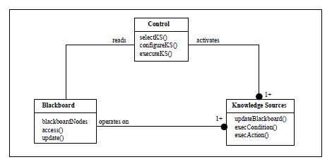

# Notes

1. 실용주의 프로그래머는 경력에 대해 책임을 지고, 자신의 무지나 실수를 인정하기를 두려워하지 않는다.
2. 깨진창문`(나쁜 설계, 잘못된 결정, 혹은 형편없는 코드)`을 고치지 않는채로 내버려 두지 마라. 발견하자마자 바로 고쳐라. 적절히 고칠 시간이 충분치 않다면 판자로 덮는 것만이라도 하라. 불쾌한 코드를 주석처리 하거나, 'not implemented' 이라는 메시지를 표시하거나, dummy 데이터로 대치해 놓거나 하라. 더 이상의 손상을 예방하기 위해 어떤 조치든 취하고 현 상황을 잘 관리하고 있다는 것을 보여 줘라.
3. 무엇이 가능한지 물어보고 판단하느니 차라리 일단 저지르고 예외가 발생하면 해당 예외를 처리하게 하자.
4. 적당히 괜찮은 소프트웨어를 생산하자. 다만 어느 정도면 적당히 괜찮은지를 결정하는 과정에 사용자가 참가할 기회를 가져야 한다.
5. 오늘의 훌륭한 소프트웨어는 많은 경우, 내일의 완벽한 소프트웨어보다 낫다.
6. 지식 포트폴리오를 만들자. (⇒ 여러 기술을 학습하라.)
    - 매년 새로운 언어를 최소 하나는 배워라.
    - 기술 서적을 분기마다 한 권씩(습관이 들면, 한 달에 한 권) 읽어라.
    - 비 기술 서적도 읽어라.
    - 수업을 들어라.
    - 지역 사용자 모임에 참여하라.
    - 다른 환경에서 실험해보라.
    - 요즘 흐름을 놓치지 마라.
    - 정보의 원천을 찾기 위해 웹 서핑을 하라.
7. 소통하라
    - 말하고 싶은 게 무언지 알아라
    - 청중을 알아라 (WISDOM)
        - What - 무엇을 배우길 원하는가
        - Interest - 말하려는 것에서 그들이 관심있어 하는 것은 무엇인가
        - Sophisticated - 얼마나 소양이 있는가?
        - Detail - 어느 정도의 구체적인 내용을 원하는가?
        - Owe - 누가 정보를 소유하길 원하는가?
        - Motive - 그들이 경청하도록 동기를 주려면 어떻게 해야 할까?
    - 때를 골라라
    - 스타일을 골라라
    - 멋져 보이게 하라
    - 청중을 참여시켜라
    - 청자가 되어라
    - 응답하라
8. 간단한 필터나 코드 생성기를 작성 - 공동의 메타데이터 표현에서 여러 개의 언어(프로젝트)에 걸쳐 있는 구조를 만들어낼 수 있다.
9. 여러분이 조성해야 할 환경이란 뭔가를 직접 만드는 것보다 기존의 것을 찾아내고, 또 재사용하기 쉬운 환경이다.
10. 직교성 - 생산성 향상 및 리스크 감소를 위해 독립적이며, 단일하고 잘 정의된 목적을 가진 컴포넌트를 설계하라.
    - 코드의 결합도를 줄여라
    - 전역 데이터를 피하라
        - 싱글톤 객체를 전역 데이터릐 일종으로 나용하지 마라
    - 유사한 함수를 피하라
        - 스트래티지 패턴을 사용
11. 코딩에서 예광탄 효과`(≠프로토타이핑 : 나중에 버릴 수 있는 코드)`를 얻으려면, 우리를 요구사항으로부터 최종 시스템의 일부 측면에까지 빨리, 눈에 보이게, 반복적을 도달하게 해줄 무언가를 찾아야 한다.
    - 예광탄 코드 접근 방법 장점
        - 사용자들은 뭔가 작동되는 것을 일찍부터 보게 된다.
        - 개발자들은 들어가서 일할 수 있는 구조를 얻는다.
        - 통합 작업을 수행할 기반이 생긴다.
        - 진전 상황에 대해 더 정확하게 감을 잡을 수 있다.
12. 프로토타입 
    - 대상
        - 아키텍쳐
            - 주요 컴포넌트의 책임이 잘 정의되었고 적절한가?
            - 주요 컴포넌트 간의 협력관계가 잘 정의되었는가?
            - 결합도는 최소화되었는가?
            - 잠재적 중복을 찾아낼 수 있는가?
            - 인터페이스 정의와 제약 사항은 수용할만한가?
            - **각 모듈이 실행 중에 필요로 하는 데이터에 접근할 수 있는 경로를 갖고 있는가? 모듈은 데이터를 필요로 할 때 데이터에 접근할 수 있는가?
        - 기존 시스템에 추가할 새로운 기능
        - 외부 데이터의 구조 혹은 내용
        - 써드파티 도구나 컴포넌트
        - 성능문제
        - 사용자 인터페이스 설계
    - 무시해도 좋은 세부사항
        - 정확성
        - 완전성
        - 안정성
        - 스타일
13. 다음과 같은 단계를 반복하는 집중적 개발(incremental development)을 연습해라.
    - 요구사항 체크하기
    - 위험 분석하기
    - 설계, 구현, 통합
    - 사용자와 함께 검증하기
14. IDE가 강제하는 편리함의 울타리 바깥에서도 능숙하게 작업할 수 있어야 한다.
15. 일반 텍스트의 장점
    - 구식이 되는 것에 대한 보험
    ```
        // 아래를 비교해보자. 무엇이 더 오래 살아남을 데이터 같은가?
        1. NTDEC02M234567
        2. <FIELD10>901202-1234567</FIELD10>
        3. <SECURITY_NUMBER>901202-1234567</SECURITY_NUMBER>
    ```

    - 호환성
    - 더 쉬운 테스트
16. 일상적으로 컴파일러의 경고 레벨을 최고로 높게 맞춰 컴파일러가 대신 찾아 줄 수 있는 문제를 찾느라 시간을 허비하지 마라.
17. 인공 테스트는 애플리케이션을 충분히 테스트하지 못한다. 경계 조건과 실제 최종사용자 사용 패턴 모두를 철저히 테스트해야 한다.
18. 디버깅 체크 리스트
    - 보고된 문제가 내재하는 버그의 직접적 결과인가 아니면 단순히 증상일뿐인가?
    - 버그가 정말로 컴파일러에 있나? OS에? 혹은 여러분 코드에 있나?
    - 이 문제를 동료에게 상세히 설명한다면 어떻게 말하겠는가?
    - 의심가는 코드가 단위 테스트를 통과한다면, 테스트는 충분히 완전한 것인가? 이 데이터로 단위 테스트를 돌린다면 무슨 일이 생기는가?
    - 이 버그를 야기한 조건이 시스템의 다른 곳에도 존재하는가?
19. 유연함을 유지하는 한 가지 좋은 방법은 가능한 적은 양의 코드를 작성하는 것이다.
20. 코드를 모듈로 구성하고, 이들 간의 상호작용을 제한하라. 그러면 한 모듈이 변경되거나 교체된다 하더라도 다른 모듈들은 변경 없이 수행될 수 있을 것이다.
21. 디미터 함수 법칙을 사용해 모듈간 결합도를 최소화하자.

    ```cpp
    // 디미터 함수 법칙 - 객체의 모든 매서드는 다음에 해당하는 메서드만 호출해야 한다고 말한다.
    class Demeter 
    {
    private:
    	A *a;
    	int func();
    public:
    	// ...
    	void example(B &b);
    };
    
    void Demeter::example(B &b)
    {
    	C c;
    	int f = func(); // 자신
    	b.invert(); // 메서드로 넘어온 인자
    	a = new A();
    	a->setActive(); // 자신이 생성한 객체
    	c.print(); // 직접 포함하고 있는 객체
    }
    
    // 디미터 법칙을 위반하는 예제
    void processTransaction(BankAccount acct, int value)
    {
    	Person *who;
    	Money amt;
    	amt.setValue(value);
    	acct.setBalance(amt);
    	who = acct.getOwner;
    	// 현 메서드가 who를 소유하지 않기 때문에 who->anme()은 법칙을 위반한 호출
    	markWorkflow(who->name(), SET_BALANCE); 
    }
    
    // 수정 버전
    void processTransaction(BankAccount acct, int value)
    {
    	Money amt;
    	amt.setValue(value);
    	acct.setBalance(amt);
    	// 현 메서드는 BankAccount 내부의 어떤 하위 객체가 이름을 가지고 있는지 알 필요가 없어야 함
    	markWorkflow(acct.name(), SET_BALANCE);
    }
    ```
22. 마치 비정규화를 통해 데이터베이스 성능을 향상시키는 것처럼 디미터 법칙과 반대로 여러 모듈의 결합도를 높힘으로써 중요한 성능향상을 꾀할 수도 있다.

23. 메타데이터`(데이터에 관한 데이터, 예 : 데이터베이스 스키마)`를 이용하여 반환 매개 변수, 사용자 선호사항, 설치 디렉토리와 같은 애플리케이션 설정 옵션을 기술하라.

24. 메타데이터 주도 애플리케이션

- 설계의 결합도를 줄여 좀 더 유연하고 적응성 있는 프로그램을 만들 수 있다.
- 세부사항을 코드 밖으로 몰아냄으로써 보다 강하고 추상적인 디자인을 만들 수 있다.
- 애플리케이션을 커스터마이징하기 위해 다시 컴파일할 필요가 없다. 이런 방식의 커스터마이징을 통해 실제 제작 공정 시스템에서 일어날 수 있는 치명적인 버그에서 벗어나는 우회로를 쉽게 만들 수 있다.
- 메타데이터는 범용 프로그래밍 언어보다 문제 도메인에 가까운 방식으로 표현될 수 있다.
- 동일한 애플리케이션 엔진과 상이한 메타데이터를 이용해 여러 다른 프로젝트를 진행할 수 있게 된다.

25. '잘 정의된 단 하나의 책임'만 가지게 모듈을 정의하라. (Single Responsibility Principle)

26.  모델과 뷰/컨트롤러를 분리하면, 적은비용으로 큰 유연성을 얻게 된다.

- 모델 : 대상 객체를 나타내는 추상 데이터 모델. 모델은 어떤 뷰나 컨트롤러에 대해서도 직접적인 지식을 지니지 않는다.
- 뷰 : 모델을 해석하는 방법. 뷰는 모델의 변화 그리고 컨트롤러가 보내는 논리적 사건을 구독한다.
- 컨트롤러 : 뷰를 제어하고 모델에 새로운 데이터를 제공하는 방법. 모델과 뷰 둘 모두에 이벤트를 보낸다.
- MVP : MVC에서 V와 C를 합쳐 단일화하고, 프레젠테이션 로직을 뽑아낸 패턴이다. MVC의 개선 버전으로 테스트하기도 더 쉽고, 현대의 GUI 라이브러리와 더 잘 맞는다.

    ```cpp
    // 아래 클래스를 MVC로 재설계하자.
    // 만약 승객을 항공편 대기 목록에 올리면, 빈 자리가 있는 경우 자동으로 해당 항공편을 예약
    // 오버부킹이라면, 추가 항공편의 일정을 언제 잡아야 할지 제안해줌
    class Flight
    {
    public:
    	bool addPassenger(Passenger p);
    	void addToWaitList(Passenger p);
    	int getFlightCapacity();
    	int getNumPassengers();
    };
    
    class Flight
    {
    public:
    	void addWaitListPassenger(Passenger p);
    	void removeFromWaitList(Passenger p);
    };
    
    class Reporter
    {
    public:
    	// to do
    };
    
    class Passenger
    {
    public:
    	void waitListAvailable();
    }; 
    ```

27. 의도적으로 프로그래밍하기

- 언제나 자지가 지금 무엇을 하고 있는지 알아야 한다.
- 맹목적으로 코딩하지 말라.
- 계획을 세우고 그것을 바탕으로 진행하라.
- 신뢰할 수 있는 것에만 기대라. 우연한 일이나 가정에 의존하지 말라.
- 여러분의 가정을 문서로 남겨라.
- 코드만 테스트할 것이 아니라 여러분이 세운 가정도 테스트해 보아야 한다.
- 노력을 기울일 대상의 우선순위를 정하라.
- 과거의 노예가 되지 말라. 언제나 리팩토링할 자세가 되어 있어야 한다.

28.  성급한 최적화을 조심하라. (Premature optimization is the root of all evil) 최적화를 하기 전에 그 알고리즘이 정말로 병목인지 먼저 확실히 해둬라.

29. 리팩터링이 필요한 이유

- 중복
- 직교성이 좋지 않은 설계
- 유효기간이 끝난 지식
- 성능

30. 리팩터링 할 때 주의할 점

- 리팩터링과 새로운 기능 추가를 동시에 하지 말라.
- 리팩터링을 시작하기 전 든든한 테스트 집합이 있는지 먼저 확인한다. 할 수 있는 한 자주 테스트들을 돌려본다.
- 단계를 작게 나누어서 신중하게 작업한다.

31. 테스트는 중요하다

- 단위 테스트 - 각 모듈의 동작을 검증하기 위해 다른 것들과 분리시켜 놓고 테스트가 이루어진다.
- 회귀 테스트 - 기능 추가나 오류를 수정한 소프트웨어가 수정에 의해 새로이 유입된 오류가 없는지 확인하는 반복 테스트
- 테스트 장치 (Testing Harness)
    - 시작할 때 할 일(setup)과 마칠 때 할 일(cleanup)을 지정할 수 있는 표준적인 방법
    - 개별적인 테스트들을 선택하거나, 아이면 모든 테스트를 한꺼번에 선택하게 해주는 메서드
    - 예상한 (또는 예상하지 못한) 결과에 비추어 결과를 분석할 수 있는 방법
    - 실패를 보고하는 표준화된 형태
- 테스트는 조립식으로 작동할 수 있어야 한다 → composite pattern ("has-a relationship")
- 테스트 윈도우 만들기
- 테스트는 기술적이라기보다는 문화적인 것이다.

32.  실용주의 팀

- 깨진 창문을 없애라
- 모든 사람이 적극적으로 환경 변화를 감시하자
- 소통하라
- 반복하지 마라
- 팀의 직교성은 개인 작업간의 상호 작용 횟수를 급격히 감소하게 해주며, 시간 척도를 줄이고, 품질을 향상시키며, 오류를 감소시킨다.
- 자동화해라
    - 환경 세팅
    - 프로젝트 컴파일
    - 코드 생성
    - 테스트
    - 빌드 자동화
    - 자동화된 관리
- 테스트해라
    - 단위 테스트
    - 통합 테스트
    - 유효성 평가(validation) 와 검증(verification)
    - 자원 고갈, 에러, 그리고 복구
        - 메모리
        - 디스크 공간
        - CPU 대여곡
        - 벽시계 시간
        - 디스크 대역폭
        - 네트워크 대역폭
        - 칼라 팔레트
        - 비디오 해상도
    - 성능 테스트
        - 초당 예상 사용자
        - 접속 혹은 트랜잭션 숫자
    - 사용펀의성 테스트

---

# Tips

1. 자신의 기술에 관심과 애정을 가져라.
2. 자신의 일에 대해 생각하면서 일하라.
3. 어설픈 변명을 만들지 말고 대안을 제시하라.
4. 깨진 창문을 내버려두지 말라.
5. 변화의 촉매가 되라.
6. 큰 그림을 기억하라.
7. 품질을 요구사항으로 만들어라.
8. 지식 포트폴리오에 주기적으로 투자하라.
9. 읽고 듣는 것을 비판적으로 분석하라.
10. 무엇을 말하는가와 어떻게 말하는가 모두 중요하다.
11. DRY - 반복하지 마라. (Don't Repeat Yourself)
12. 재사용하기 쉽게 만들라.
13. 관련 없는 것들 간에 서로 영향이 없도록 하라.
14. 최종 결정이란 없다.
15. 목표물을 찾기 위해 예광탄을 써라.
16. 프로토타입을 통해 학습하라.
17. 문제 도메인에 가깝게 프로그래밍하라.
18. 추정을 통해 놀람을 피하라.
19. 코드와 함께 일정도 반복하며 조정하라.
20. 지식을 일반 테스트로 저장하라. (때에 따라 적절히 선택)
21. 명령어 셸의 힘을 사용하라.
22. 하나의 에디터를 잘 사용하라.
23. 언제나 소스코드 관리 시스템을 사용하라.
24. 비난 대신 문제를 해결하라.
25. 디버깅을 할 때 당황하지 마라.
26. 'select'는 망가지지 않았다. (개발하고 있는 애플리케이션 코드에 버그가 존재할 가능성이 훨씬 더 크다.)
27. 가정하지 마라. 증명하라.
28. 텍스트 처리 언어를 하나 익혀라.
29. 코드를 작성하는 코드를 작성하라.
30. 완벽한 소프트웨어는 만들 수 없다.
31. 계약에 따른 설계를 하라. (Design By Contract)
32. 일찍 작동을 멈추게 하라.
33. 단정문을 사용해서 불가능한 상황을 예방하라.
34. 예외는 예외적인 문제에 사용하라.
35. 시작한 것은 끝내라.
    
    ```cpp
    // 예제
    // bad.
    void doSomething()
    {
    	Node *n = new Node;
    	try 
    	{ // do sth 
    	}
    	catch (/*...*/)
    	{
    		delete n; // <-
    		throw;
    	}
    	delete n; // <- 노드가 해제되는 장소가 두 군데 (DRY 원칙 위반)
    }
    // good.
    class NodeResource
    {
    	Node *n;
    public:
    	NodeResource() { n = new Node(); }
    	~NodeResource() { delete n; }
    	Node *operator->() { return n; }
    };
    void doSomething2()
    {
    	NodeResource n;
    	try 
    	{ // do sth 
    	}
    	catch (/*...*/)
    	{
    		throw;
    	}
    }
    // std library
    void doSomething3()
    {
    	auto_ptr<Node> p (new Node);
    	// 노드를 p->... 처럼 사용한다.
    	// 스코프 밖으로 나가면 자동으로 노드는 해제된다.
    }
    ```

36. 모듈간의 결합도를 최소화하라.

37. 통합하지 말고 설정하라.

38. 코드에는 추상화를, 메타데이터에는 세부 내용을.

39. 작업흐름 분석을 통해 동시성을 개선하라.

40. 서비스를 사용해서 설계하라.

41. 언제나 동시성을 고려해 설계하라.

42. 모델에서 뷰를 분리하라.

43. 칠판`(한 사람의 전문가로 해결 불가능한 복잡한 문제를 해결할 경우에, 중앙에 칠판을 두고서 아이디어를 내어가면서 부분적으로 문제를 해결해 가면서 논의를 진행시켜 가는 것과 같은 개념을 컴퓨터에 실현시킨 것)`을 사용해 작업흐름을 조율하라.


*출처 : [https://en.wikipedia.org/wiki/Blackboard_(design_pattern)](https://en.wikipedia.org/wiki/Blackboard_(design_pattern))*

44. 우연에 맡기는 프로그래밍을 하지 말라.

45. 여러분 알고리즘의 차수를 추정하라.

46. 여러분의 추정을 테스트하라.

47. 일찍 리팩터링하고, 자주 리팩터링하라.

48. 테스트를 염두에 두고 설계하라.

49. 소프트웨어를 테스트하라. 그렇지 않으면 사용자가 테스트하게 될 것이다.

50. 자신이 이해하지 못하는, 마법사가 만들어 준 코드는 사용하지 말라.

51. 요구사항을 수집하지 말고 채굴하라.

52. 사용자처럼 생각하기 위해 사용자와 함께 일하라.

53. 구체적인 것보다 추상적인 것이 더 오래간다.

54. 프로젝트 용어사전을 사용하라.

55. 생각의 틀을 벗어나지 말고, 틀을 찾아라.

56. 준비가 되었을 때 시작하라.

57. 어떤 일들은 설명하기보다 실제로 하는 것이 쉽다.

58. 형식적 방법(UML, Agile, 폭포수 모델 등)의 노예가 되지 마라. 누가 주인인지 분명히 기억해라.

59. 비싼 도구가 더 좋은 설계를 낳지는 않는다.

60. 팀을 기능 중심으로 조직하라.

61. 수작업 절차를 사용하지 말라.

62. 일찍 테스트하고, 자주 테스트하라. 자동으로 테스트 하라.

63. 모든 테스트가 통과하기 전엔 코딩이 다 된 게  아니다.

64. 버그를 의도적으로 써서 (파괴자) 테스트를 테스트하라.

65. 코드 커버리지보다 상태 커버리지를 테스트하라.

66. 버그는 한 번만 잡아라.

67. 국어도 하나의 프로그래밍 언어인 것처럼 다루라.

68. 문서가 애초에 전체의 일부가 되게 하고, 나중에 집어넣으려고 하지 말라.

69. 사용자의 기대를 부드럽게 넘어서라.

70. 자신의 작품에 서명하라.

---

# 연습문제

```cpp
// C longjmp/setjmp로 일종의 대용 예외 메커니즘 구현
#include <stdio.h>
#include <setjmp.h>

static jmp_buf buf;

FILE *filePtr = NULL;

void handleFile(const char *fileName)
{
    openUserFile(fileName);
    writeUserFile();
}

void openUserFile(const char *fileName)
{
    filePtr = fopen(fileName, "w");
    if (filePtr == NULL)
        longjmp(buf, 1);
}

int main()
{
    if (!setjmp(buf))
        handleFile("a.txt");
    else
        printf("error; unable to handle a user file");

    return 0;
}
```

```cpp
// 1000000개 node로 이루어진 Balanced Binary Search Tree의 내용을 
// 출력하는 함수의 공간 복잡도는? lg(1000000) * 1000 ~= 20000
void printTree(const Node *node)
{
    char buffer[1000];
    if (node)
    {
        printTree(node->left);
        getNodeAsString(node, buffer);
        puts(buffer);
        printTree(node->right);
    }
}
// 위 알고리즘 최적화 -> buffer 재사용
void tryPrintTree(const Node *node)
{
    char buffer[1000];
    printTree(node, buffer);
}

void printTree(const Node *node, char *buffer)
{
    if (node)
    {
        printTree(node->left, buffer);
        getNodeAsString(node, buffer);
        puts(buffer);
        printTree(node->right);
    }
}
```

```cpp
// 아래 코드를 리팩토링해라
if (state == TEXAS)
{
    rate = TX_RATE;
    amt = base * TX_RATE;
    calc = 2 * basis(amt) + extra(amt) * 1.05;
}
else if ((state == OHIO) || (state == MAINE))
{
    rate = (state == OHIO) ? OH_RATE : ME_RATE;
    amt = base * rate;
    calc = 2 * basis(amt) + extra(amt) * 1.05;
    if (state == OHIO)
        points = 2;
}
else
{
    rate = 1;
    amt = base;
    calc = 2 * basis(amt) + extra(amt) * 1.05;
}

// 리팩토링한 버전
map<int, int> rateMap = { {OHIO, OH_RATE}, {TEXAS, TX_RATE}, {MAINE, ME_RATE} };
if (rateMap.end() == rateMap[state])
    rate = 1;
else
    rate = rateMap[state];

amt = base * rate;
calc = 2 * basis(amt) + extra(amt) * 1.05;
    
if (state == OHIO)
    points = 2;
```