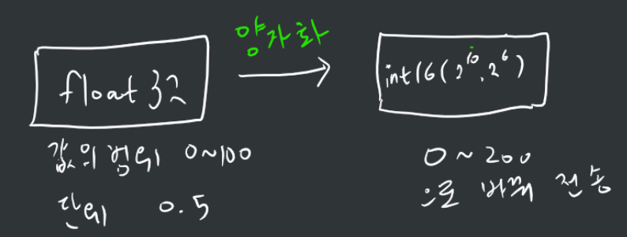

## Ch 4. 게임 서버와 클라이언트

### 게임 서버의 품질

- 안정성
    1. 치밀한 개발과 유닛 테스트
    2. 80:20 법칙 - 모든 프로그램의 성능 80%는 20%의 소스코드에서 나타난다는 파레토 법칙

        → 성능에 지대한 영향을 주는 일부분의 소스 코드에서만 프로그램 구조가 복잡해지더라도 성능을 최적하해서 개발하고, 나머지는 유지 보수가 쉽게 단순하게 개발

    3. 1인 이상의 코드 리뷰
    4. 가정하지 말고 검증하라 - load and performance test
- 확장성
    ### Scale-up vs Scale-out
    |구분          |Scale Up                                                                             |Scale Out                                             |비고                                                                            |
    |------------|-------------------------------------------------------------------------------------|------------------------------------------------------|------------------------------------------------------------------------------|
    |확장 종류       |서버 머신의 부품 업그레이드/증설                                                                   |서버 머신 개수 증설                                           |                                                                              |
    |서버 소프트웨어 설계 비용|낮음                                                                                   |높음                                                    |                                                                              |
    |확장 비용       |기하급수적으로 높아짐                                                                          |선형적으로 높아짐                                             |                                                                              |
    |과부하 지점      |서버 머신 자체                                                                             |네트워크 장치                                               |                                                                              |
    |오류 가능성      |로컬 머신 안에서 동기 프로그래밍 방식으로 작동하므로 낮음                                                     |여러 머신에 걸쳐 비동기 프로그래밍 방식으로 작동하므로 높음                     |                                                                              |
    |단위 처리 속도    |로컬 머신의 CPU와 RAM만 사용                                                                  |여러 서버 컴퓨터 간의 메시징이 오가면서 처리하므로 낮음                       |Scale-out 메세지 처리 과정 : 유저프로세스 → 커널 → 디바이스 → 회선 → 라우터 → 회선 → 디바이스 → 커널 → 유저 프로세스|
    |처리 가능 총량    |머신 한 대의 성능만 사용하므로 낮음                                                                 |여러 서버 컴퓨터로 부하가 분산되므로 높음                               |                                                                              |

- 성능
    - 기본적인 원칙은 서버의 단위 처리 속도를 높이는 것
        - 알고리즘, 코드 최적화
    - 클라이언트가 일부 게임 로직 판정을 하게끔 함
    - Path Table 테크닉 : NPC 길찾기 알고리즘이 소요하는 처리 시간을 `O(1)`으로 개선
    - 네트워크 프로토콜 최적화
        - 메세지 양 최소화
            1. 메세지 압축 (e.g. ZLib) → 멀티플레이 게임에서 차지하는 대부분의 데이터는 캐릭터 이동과 관련된 것인데 이는 데이터의 단위 크기가 수십 바이트 정도로 작은 데다 ZLib처럼 압축 여지가 있는 데이터 패턴을 이루지 않으므로 압축 효과가 떨어질 수 있음
            2. 양자화 (Quantization) : 정수 혹은 부동소수점 값의 정밀도를 낮추는 대신 값이 차지하는 데이터 크기를 줄이는 방법

            

    - 고품질 네트워크 회선을 가진 데이터센터에 서버 설치
    - P2P 네트워크 사용 → 물론 P2P 연결을 맺거나 끊는 것은 서버가 승인해야함
        - 왜? 해킹된 클라이언트가 다른 아무 클라이언트에 P2P 연결을 맺어 버리고, 잘못된 데이터를 전송할 수 있기 때문
    - CS 모드

### 클라우드 서버가 제공하는 기능

- IaaS (Infrastructure as a Service) - 가상머신 자체를 제공하는 서비스
    - AWS EC2, Azure Virtual Machine
- PaaS (Platform as as Service) - IaaS보다 상위 계층에서 작동하는 프레임워크 서비스
    - AWS Lambda, Azure Functions, 웹 호스팅 서비스, Kubernetes (전통적인 Paas는 아님.)
- SaaS (Software as a Service) - PaaS보다 상위에 있는 특화 기능을 제공하는 서비스
    - AWS Cognito, Azure Marketplace, Google Analytics
