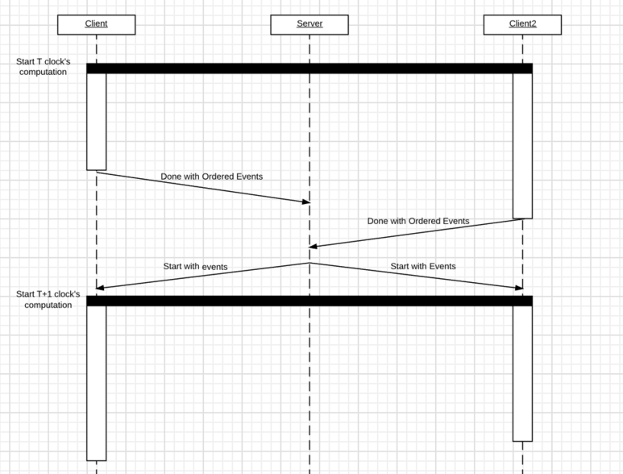
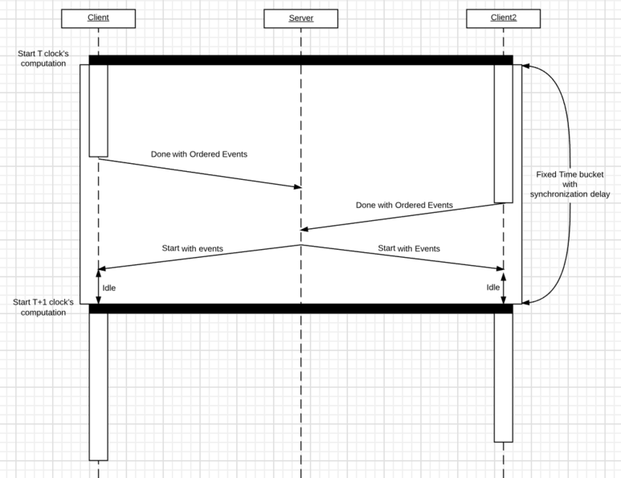

## Ch 5. Game Networking

### 클라이언트 <> 서버 네트워킹

- 아래의 과정이 원할하게 진행되려면, 레이턴시가 1/60초보다 훨씬 낮아야 하며, 레이턴시가 항상 균일해야 함, 그러나 쉽지 않은 일이며, 보통 100ms마다 업데이트를 진행함

    → 클라이언트가 받아서 바로 처리하게 되면 움직임이 딱딱해질 수 있음. 따라서 상태 값 보정을 함

    1. 서버는 n ms마다 월드 상태를 업데이트함
    2. 서버는 n ms마다 월드 상태의 변화를 클라이언트에 전송함
    3. 클라이언트는 받은 것을 자기 월드 상태에 반영, 다음 렌더링 프레임에서 그림 
- 상태 값 보정
    - 서버에서 받는 상태 변화 메시지를 즉시 반영하는 것이 아니라, 일정 시간에 걸쳐 서서히 목적 상태로 변화하게 하는 것
    - 그러나 반영하는 시간이 한 템포 느리므로, 여러 클라이언트 사이의 비동기화가 일어날 수 있음

        → 다른 클라이언트의 위치 정보를 받았을 때 이미 지난 시간만큼 예측함 (추측항법)

- **Dead Reckoning (추측 항법)** → Optimistic Approach
    - Latency Masking 방법 중 하나로 서버 혹은 클라이언트가 캐릭터의 움직임을 어느 정도 예상해서 그 위치로 갈 수 있게 보정(선형 보간, 스플라인)시키는 알고리즘
    - 어떤 것을 추측할까? e.g. Round Trip Time
    - 캐릭터 위치뿐만 아니라 캐릭터가 바라보고 있는 방향이나 모션 상태 값도 추측항법을 적용하면 더 정확한 행동을 보여줄 수 있음
    - 추측 항법의 한계
        1. Transmission Delay가 발생하고 서버 쪽 데이터 처리 로직 혹은 다른 유저에게 브로드캐스팅하는 게 걸리는 시간 등이 있기 때문에 종종 오차가 발생
        2. 통신 오류 발생 시 동기화 이후 캐릭터 위치가 워프되는 현상 발생

### Latency Masking 방법

1. 사소한 것들은 클라이언트에서 판단하기 - 플레이어가 자신이 조종하는 플레이어 캐릭터의 위치 계산은 클라이언트에서 판단하고, 클라이언트는 판단 결과를 서버에 보내 주는 것

    Q. 만약 클라이언트 해킹으로 이동 속도를 굉장히 빠르게 했다면? 

    → 해결 방법 1) 서버가 클라이언트 이동 정보를 받아서 정상적인 값 범위에 있는지 검사

    → 해결 방법 2) 클라이언트가 일방적으로 먼저 캐릭터를 움직인 후 서버에 이동 정보를 보내면, 서버가 정보에 따라 이동을 처리하고 클라이언트에 이동 메세지를 보냄. 그 이후 일방적으로 움직였던 이동 위치를 무시하고, 클라이언트가 서버 메세지를 따라 캐릭터를 재이동시킴

    → 해결 방법 2가 해킹을 막는 데 더 좋지만, 레이턴시가 높으면 캐릭터의 움직임이 손상됨

2. 된 것 처럼 보여 주고 나중에 얼렁뚱땅하기
    1. 행동을 하면 행동 메세지를 서버에 보내고, 클라이언트는 즉시 행동 연출의 일부를 보여줌
    2. 서버에서 행동 메세지를 받아 처리하고, 캐릭터에 다음으로 일어나야 하는 행동을 클라이언트에 보냄
    3. 클라이언트는 메세지를 받으면 연출해야하는 나머지 부분을 보여줌 

    e.g. 공격 키를 눌렀을 때 캐릭터가 일단 공격 행동을 보여주고, 뒤늦게 공격이 들어가는 디아블로3   

    `youtube:https://www.youtube.com/watch?v=n_6sk_Qz4p0`

### 넓은 월드, 많은 플레이어 처리

- 가시 영역 필터링 : 게임 월드 안에 캐릭터 수가 너무 많으면 통신량이 증가하는 문제를 해결하기 위한 방법 중 하나
    - 서버가 가진 월드 전체 상태 중에서 변화하는 것 모두를 플레이어에게 보내 줄 필요가 없음, 플레이어의 가시 영역에 있는 것들만 보내도 충분함
    - 따라서, 서버는 다음 정보를 가지고 있어야 함
        1. 플레이어 각각에 대해서 각 플레이어가 볼 수 있는 캐릭터 목록
        2. 캐릭터 각각에 대해서 자기 자신을 볼 수 있는 플레이어 목록

### 실시간 게임에서 네트워크 동기화

1. **Conservative Algorithm**
    - **Lock step Synchronization** - 씬을 구성하는 캐릭터의 이동 상태를 주고 받지 않고, 각 클라이언트 플레이어의 입력 명령만 주고받음 → 장점 : 입력 명령은 통신량이 상대적으로 매우 적기에 꽤 많은 캐릭터가 정확히 동기화될 수 있음

        

        **[출처] [멀티플레이 게임의 동기화 기법 시리즈 2편: 이벤트 동기화](https://blog.naver.com/linegamedev/221061964789)|작성자 [linegamedev](https://blog.naver.com/linegamedev)**

        1. 각 플레이어는 다른 플레이어들에게 입력 명령을 보냄
        2. 플레이어의 입력 명령에 따라 모든 클라이언트가 동시에 씬 업데이트를 진행

            → 모든 클라이언트가 동시에 입력 명령을 받는 것이 아니기 때문에 동기화 문제 발생, 따라서 '언제 실행해야 하는지에 대한 미래 시간'을 함께 보냄

            → 입력 명령을 보내는 클라이언트 주채도 명령을 바로 실행하는 것이라 아니라 일정 시간 이후해 실행함, 받는 클라이언트도 마찬가지임. (latency masking의 얼렁뚱땅 테크닉)

            - 미래 시간 = 현재시간 + 왕복 레이턴시 (RTT) / 2 + 임의의 일정 값

                → 너무 멀면 캐릭터 움직임이 굼뜨게 따르는 형태의 랙 현상이 생기고, 너무 가까우면 캐릭터 움직임이 중간중간 튀는(stuttering) 형태의 랙 현상이 발생함

        - 락스텝의 한계
            1. 다른 플레이어가 플레이하고 있는 게임 중간에 확 들어오는 것을 만들기 까다로움
            2. 물리 엔진 등 게임 플레이에 관여하는 연산에 부동소수점을 쓸 수 없음 → 부동소수점 연산은 하드웨어 종류에 따라 연산 결과가 미세하게 차이가 날 수 있는데, 이 미세한 차이가 누적되면 큰 차이로 이어질 수 있음
            3. 플레이어 수를 무작정 늘릴 수 없음 → 통신량이 플레이어 수에 비례해서 증가하기 때문
            4. 가시 영역 필터링 사용 어려움 → 모든 클라이언트가 모든 캐릭터 정보를 가지고 있어야 모두 정확한 게임 플레이 결과를 낼 수 있기 때문
            5. 씬 업데이트가 일시 정지할 확률이 높음 → ***원할하게 게임 플레이를하려면 함께 플레이하는 플레이어 중에서 가장 레이턴시가 높은 사람을 기준으로 미래 시간이 결정되어야 함*** (옛날 스타크래프트에서 레이턴시가 높은 플레이어에 맞춰서 게임이 진행되어서 버벅거렸던 것을 떠올려라)
            6. 입력 명령의 속도에 민감한 게임에 부적합 → 필연적으로 캐릭터에게 넣은 행동은 미래 시간이 되어야 움직이기 때문
    - **Fixed Time Bucket Synchronization** - 클라이언트들의 Transmission Delay를 측정하여 대략적인 delay를 결정함으로써 Regular Rate를 보장해 락스텝의 한계 5번(`클라이언트간의 서로 다른 Transmission Dely에 의해 Regular Rate로 게임을 진행할 수 없다는 것`)을 보완함 → 역시 Synchronization Delay 동안 무조건 쉬도록 하고 있기 때문에, 높은 Frame Rate를 확보하기 어려워 Interactive한 환경에서는 적용하기 어려움

        

        **[출처] [멀티플레이 게임의 동기화 기법 시리즈 2편: 이벤트 동기화](https://blog.naver.com/linegamedev/221061964789)|작성자 [linegamedev](https://blog.naver.com/linegamedev)**

2. **Optimistic Algorithm**
    - **Time Warp Synchronization** -

- For more reference, visit the followings:

    `youtube:https://www.youtube.com/watch?v=W3aieHjyNvw`

    [An Efficient Synchronization Mechanism for Mirrored
Game Architectures](http://citeseerx.ist.psu.edu/viewdoc/download?doi=10.1.1.87.6043&rep=rep1&type=pdf)

### 실제 레이턴시 줄이기

1. TCP 대신 UDP를 사용함 → 이동 패킷의 경우 여러번 발생하는 패킷이기 때문에 이어서 오는 다른 패킷에 의해 오차가 금방 회복될 수 있기에 UDP 사용에 적합함
2. 패킷을 뭉쳐서(Coalescence) 한 번에 보내는 Nagle Option의 선택적 적용 → 물론 뭉치기 위해 기다리는 시간이 발생하니, 뭉치는 시간은 10ms 이하가 적당

    **TIP** : 서버 쪽에서는 Nagle 옵션을 활성화하고, 클라이언트 쪽은 비활성하는 게 일반적

3. Client Server Networking과 P2P Networking을 섞어서 쓰는 방법

    e.g. 전투 판정 같은 중요 연산은 CS 방식을, 채팅이나 이동 같이 덜 중요한 연산은 P2P 방식 채택

### 게임 플레이 이외의 네트워킹

1. 로그인
2. 아이템 거래
3. 매치매이킹
    - 유념해야하는 부분
        1. 해킹을 방지하고자 방 만들기 혹은 들어가기 정보는 클라이언트에서 판단하지 말고 서버에서 모두 판단할 것
        2. 클라이언트에서는 일방적으로 판단하지 말고 서버에 요청하여 그 결과에 따라서 행동할 것
        3. 방 만들기 혹은 방 들어가기로 서버 내부의 방 목록이나 방 안의 플레이어 목록이 변할 때 클라이언트는 그 변화를 통보받을 것

#### 네트워킹 해킹

- 대칭 키 알고리즘 (e.g. Advanced Encryption Standard) - 암호 키로 암호화와 복호화를 하는 알고리즘
    - 암호 키 : 대칭 키 혹은 세션 키
    - 암호 키 1 : 공개 키
    - 암호 키 2 : 개인

### 용어 정리
- 온 프리미스 (On-premise) 서버 - 데이터센터에 직접 서버 하드웨어와 운영체제를 설치해 관리하는 것
- 멀티캐스트 vs 브로드캐스트
    - 둘 다 여러 다른 호스트에게 데이터를 전송하는 것을 의미하지만, 브로드캐스트는 불특정 다수에 전송하고, 멀티캐스트는 수신자가 누구인지 명확히 지정