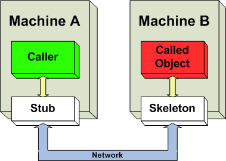

- 네트워크란?
    - 프로토콜
        - UDP, TCP
    - P2P
        - 대역폭 `O(n^2)` 필요, 사용자 수의 제곱에 비례하여 대역폭이 소모됨
    - CS
        - 대역폭 `O(n)` 필요,
- 게임 개발에 C++을 사용하는 이유?
    - C++은 성능과 관련하여 부작용이 거의 없고, 대부분의 플랫폼에서 사용할 수 있는 언어이기 때문
    - 게임 업계와 게임 엔진 프로그래머 사이에서 표준 언어로 취급됨
- 온 프리미스 (On-premise) 서버 - 데이터센터에 직접 서버 하드웨어와 운영체제를 설치해 관리하는 것
- 멀티캐스트 vs 브로드캐스트
    - 둘 다 여러 다른 호스트에게 데이터를 전송하는 것을 의미하지만, 브로드캐스트는 불특정 다수에 전송하고, 멀티캐스트는 수신자가 누구인지 명확히 지정
- Mechanisms to invoke or call processes that are running on a different computer.
    - RMI (Remote Method Invocation) - 원격 메서드 호출 (Object-oriented)

        

        [출처] [https://en.wikipedia.org/wiki/Distributed_object_communication](https://en.wikipedia.org/wiki/Distributed_object_communication)

    - RPC (Remote Procedure Call)

---

## Ch 1. 멀티스레드 프로그래밍

- 멀티스레드 프로그래밍을 해야하는 시점
    1. 오래 걸리는 일 하나와 빨리 끝나는 일 여럿을 같이 해야 할 때
    2. 어떤 긴 처리를 지행하는 동안 다른 짧은 일을 처리해야 할 때
    3. 기기에 있는 CPU를 모두 사용해야 할 때
- 멀티스레드로 서버를 개발하는 경우
    1. 서버 프로세스를 많이 띄우기 곤란할 때, 예를 들어 프로세스당 로딩해야 하는 게임 정보(멥 데이터 등)의 용량이 매우 클 때
    2. 서버 한 대의 프로세스가 여러 CPU의 연산량을 동원해야 할 만큼 많은 연산을 할 떄
    3. 코루틴이나 비 동기 함수를 쓸 수 없고 디바이스 타임이 발생 할 때
    4. 서버 인스턴스를 서버 기기당 하나만 두어야 할 때
    5. 서로 다른 multiplayer session이 같은 메모리 공간을 액세스해야 할 때
- 멀티스레드 프로그래밍에서 고려할 점
    1. atomicity
    2. consistency
    3. synchronization
- 멀티스레드 프로그래밍을 위한 도구
    - critical section
    - mutex
        - 뮤텍스를 너무 잘게 나누면 생기는 문제
            1. 오히려 성능이 떨어짐. 뮤텍스를 액세스하는 과정 자체가 무겁기 때문임
            2. 프로그램이 복잡해짐. 특히 dead lock 문제가 쉽게 발생함
    - event : 잠자는 스레드를 깨우는 도구
        - reset : 이벤트가 없음
        - set : 이벤트가 있음

            // 예제
            Event evt1;
            void Thread1()
            {
            	evt1.wait();
            }
            void Thread2()
            {
            	evt1.wait();
            }
            void Thread3()
            {
            	evt1.PulseEvent();
            }

    - semaphore
        - 오로지 스레드 1개만 자원을 액섹스할 수 있는 critical section과 mutex와는 달리 n개의 개수의 스레드가 자원을 액세스할 수 있게 함
        - 0 이상의 정수인 상태 값을 가질 수 있음

            // 예제
            Queue<int> queue;
            Semaphore queueIsNotEmpty;
            
            void main()
            {
            	queueIsNotEmpty = new Semaphore(0);
            }
            void Thread1()
            {
            	while(true)
            	{
            		queueIsNotEmpty.wait();
            		queue.pop();
            	}
            }
            void Thread2()
            {
            	while(true)
            	{
            		queue.push_back(1);
            		queueIsNotEmpty.release();
            	}
            }

- atomic operation (원자 조작)
    - mutex나 critical section lock 없이도 여러 스레드가 안전하게 접근할 수 있게 하드웨어 차원에서 보장해주는 operation
- dead lock
    - 교착 상태를 예방하려면 잠금 순서를 지켜야 함

        // dead lock 발생 예제
        class CriticalSection
        {
        	CRITICAL_SECTION m_critSec;
        public:
        	CriticalSection() { InitializeCriticalSectionEx(&m_critSec, 0, 0); }
        	~CriticalSection() { DeleteCriticalSection(&m_critSec); }
        	void Lock() { EnterCriticalSection(&m_critSec); }
        	void Unlock() { LeaveCriticalSection(&m_critSec); }
        };
        
        class CriticalSectionLock()
        {
        	CrticalSection *m_pCritSec;
        public:
        	CriticalSectionLock(CriticalSeciton& critSec)
        	{
        		m_pCritSec = &critSec;
        		m_pCritSec->Lock();
        	}
        	~CriticalSectionLock() { m_pCritSec->Unlock(); } 
        };
        
        int a, b;
        CriticalSection a_mutex, b_mutex;
        
        int main()
        {
        	thread t1({
        		while(true)
        		{
        			CriticalSectionLock lock(a_mutex);
        			a++;
        			CriticalSectionLock lock(b_mutex); // <- 문제 생기는 지점. Owned by t2 already.
        			b++;
        			cout << "t1 done" << endl;
        		}
        	});
        
        	thread t2({
        		while(true)
        		{
        			CriticalSectionLock lock(b_mutex);
        			b++;
        			CriticalSectionLock lock(a_mutex);
        			a++;
        			cout << "t2 done" << endl;
        		}
        	});
        
        	t1.join();
        	t2.join();
        
        	return 0;
        }

- 멀티스레드 프로그래밍의 흔한 실수들
    1. 읽기와 쓰기 모두에 잠금하지 않기
    2. 잠금 순서 꼬임
    3. 적당하지 않은 잠금 범위
        - 잠금 객체 범위가 너무 넓으면 context switch가 발생할 때 운영체제가 해야 할 일이 매우 많아 짐 → 처리 병렬성이 떨어짐
        - 잠금 범위를 좁히면 context switch 확률은 줄어드나 잠금 자체에서 오는 부하가 있을 수 있음
    4. 디바이스 타임이 섞인 잠금
    5. 잠금의 전염성으로 발생한 실수

        // 예시
        class Player
        {
        	int x, y;
        };
        
        mutex list_mutex;
        List<Player*> playerList;
        
        void func()
        {
        	lock(list_mutex);
        	Player* p = playerList.front();
        	unlock(list_mutex);
        	++p->x; // unlock후 로컬 변수가 가리키는 주소 값을 읽고 쓰게되어 문제 발생
        }

    6. 잠금된 mutex나 critical section 삭제

        // 예시
        class Player
        {
        	mutex player_mutex;
        	int x, y;
        };
        
        void func()
        {
        	Player* p = new Player();
        	lock(p->player_mutex);
        	delete p; // 잠금되어있는 객체를 파괴할 때 잠금하고 있으면 오류를 내게끔 수정 필요
        }

    7. 일관성 규칙 깨기

        class Node
        {
        	Node* next;
        };
        
        Node* list = null;
        int listCount = 0;
        
        mutex mutex_list;
        mutexp mutex_listCount;
        
        void func()
        {
        	lock(mutex_list);
        	Node *node = new Node();
        	node->next = list;
        	list = node;
        	unlock(mutex_list);
        	
        	lock(mutex_listCount);
        	++listCount; // 항상 의도한대로 동작하지 않을 수 있음
        	unlock(mutex_listCount);
        }

- 병렬성 (Parallelism) : 여러 CPU가 각 스레드의 연산을 실행하여 동시 처리량을 올리는 것
- 시리얼 병목 (Serial Bottleneck) :  병렬로 실행되게 프로그램을 만들었는데 정작 한 CPU만 연산을 수행하는 현상
- 암달의 법칙 (Amdahl's Law) : 시리얼 병목이 있을 때, CPU 개수가 많을수록 총 처리 효율성이 떨어지는 현상
- 스레드 풀링 (Thread pooling)
    - 스레드 개수 규칙 TIP
        - 어떤 서버의 주 역할이 CPU 연산만 하는 스레드라면 (즉, 디바이스 타임이 없다면) 스레드 풀의 스레드 개수는 서버의 CPU 개수와 동일하게 잡아도 충분함
        - 서버에서 데이터베이스나 파일 등 다른 것에 액세스하면서 디바이스 타임이 발생할 때 스레드 개수는 CPU 개수보다 많아야 함
        - 우리 서버는? Cache 서버는 n개, Game 서버는 x개

---

## Ch 2. 네트워크

- 네트워크 품질 기준
    1. Throughput : 전송될 수 있는 데이터 단위 시간당 총량
    2. Packet loss : 데이터가 목적지에 도착하는 데 걸리는 시간
    3. Latency : 전송되는 데이터가 목적지에 도착하는 데 걸리는 시간
- OSI 7 계층
    1. Application
        - HTTP, MQTT, FTP, DNS, SMTP, Telnet, SSL 등
    2. Presentation
    3. Session
    4. Transport
        - UDP (User Datagram Protocol)
            - Unreliable : 패킷 유실 현상, 순서 뒤바뀜, 중복 수신 현상이 발생할 수 있음
                - 패킷이 유실되면 데이터그램이 유실됨, 그러나 latency는 tcp보다 높지 않음

                    → 이 때문에 레이턴시가 민감하거나 패킷 유실이 있어도 괜찮은 캐릭터 이동, 음성, 화상 데이터 전송에 주로 쓰임

            - 데이터 형태가 스트림이 아닌 메시지 성질을 가짐
                - 0 바이트 데이터그램 수신 허용
        - TCP (Transmission Control Protocol)
            - Reliable : 보내는 쪽 데이터가 받는 쪽에서 완전히 동일함을 보장해 줌
                - Flow Control : 수신 한도를 넘어 과잉 패킷 입력으로 packet loss나 lock up이 일어나지 않도록 패킷 흐름양을 제어하는 방식
                - Slow Start : 혼잡한 상황을 회피하기 위해 전송량을 처음에는 적게 보내고 시간에 따라 점진적으로 증가시켜서 패킷을 보내는 방식
                - Nagle Algorithm : 조금씩 여러 번 보내지 않고, 한번에 뭉쳐서 보내는 방식
            - 단점
                - 패킷이 유실되면 유실된 패킷을 다시 전송하기 때문에 중간에 letency (RTO, retransmission time out)발생됨 → head of line blocking

            - 데이터 형태가 스트림 성질을 가짐
                - `recv()`에서 수신된 데이터 크기가 `0바이트`이면, `'연결이 종료되었음'`을 의미

                    `recv()`가 return하는 값이 `음수`라면, `'소켓 끊김'` 등의 오류를 의미

                - e.g. aa, bb, ccc 를 보내면, a, ab, bccc 나 aabbccc로도 받을 수 있음
            - Connection-oriented, 1:1 Communication
    5. Network
        - IP (Internet Protocol)
            - Segment
            - 보통 MTU(maximum transmission unit)는 1300 bytes
        - WAN
    6. Data Link
        - MAC Address
        - LAN
    7. Physical
- 네트워크 주소 변환 (Network Address Translation, NAT)

---

## Ch 3. 소켓 프로그래밍

- 블로킹 (blocking) : 디바이스에 처리 요청을 걸어 놓고 응답을 대기하는 함수를 호출할 때 스레드에서 발생하는 대기 현상
- 블로킹 소켓 vs 넌블로킹 소켓
    - 블로킹 소켓 : 소켓 함수 호출 시 조건이 만족되지 않으면 함수는 리턴하지 않고 해당 스레드는 대기 상태가 됨
    - 넌블로킹 소켓 : 소켓 함수 호출 시 조건이 만족되지 않더라도 함수가 리턴하므로 해당 스레드는 계속 진행 할 수 있음
        - 넌블로킹 소켓에서는 WSAEWOULDBLOCK를 항시 체크하여 다시 소켓함수를 호출해야 함 → CPU 사용률 높음
- Select 모델
    - 소켓 함수를 호출해야 할 시점을 알려줌으로써 함수 호출 시 항상 성공하도록 하는 것

        → 블로킹 소켓에서 select 모델을 사용하면 소켓 함수 호출 시 조건이 만족되지 않아 블로킹되는 상황 피할 수 있음

        → 넌블로킹 소켓에서 select 모델을 사용하면 CPU 자원 소모 문제 해결 가능

    - `WSAAsyncSelect()`, `WSAEventSelect()`, `WSAPoll()`, `poll()`
- Overlapped I/O or Asynchronous I/O
    - 장점 : 재시도용 호출 낭비 문제와 소켓 함수에 데이터 블록 복사 부하 문제를 모두 해결해줌
    - 단점 : 완료되기 전까지 Overlapped status 객체가 데이터 블록을 중간에 훼손하지 말아야 함

        또한, windows이 아닌 linux에서는 아직 mature한 api를 제공하지 않고 있음

- Epoll - Linux, Android
    - **넌블록 소켓이 I/O 가능 상태**가 되면 이를 감지해서 사용자에게 알림을 해줌
    - Select 모델과 달리 모든 소켓에서 루프를 도는 것이 아니라 I/O가능인 상태의 소켓에서만 루프를 돌면 됨

            // to do : select 모델이랑 epoll 비교

- IOCP (Input/Output Completion Port) - Windows
    - **소켓의 Overlapped I/O**가 **완료 상태**가 되면 이를 감지해서 사용자에게 알려줌
    - epoll과 달리 스레드 풀을 쉽게 구현할 수 있음
        - IOCP는 소켓 하나에 대한 완료 신호를 스레드 하나만 처리할 수 있게 보장

[IOCP vs Epoll](Untitled/IOCP%20vs%20Epoll.csv)

- For more reference, visit the following website.

    [Winsock Programmer's FAQ: Which I/O Strategy Should I Use?](https://tangentsoft.net/wskfaq/articles/io-strategies.html)

---

## Ch 4. 게임 서버와 클라이언트

### 게임 서버의 품질

- 안정성
    1. 치밀한 개발과 유닛 테스트
    2. 80:20 법칙 - 모든 프로그램의 성능 80%는 20%의 소스코드에서 나타난다는 파레토 법칙

        → 성능에 지대한 영향을 주는 일부분의 소스 코드에서만 프로그램 구조가 복잡해지더라도 성능을 최적하해서 개발하고, 나머지는 유지 보수가 쉽게 단순하게 개발

    3. 1인 이상의 코드 리뷰
    4. 가정하지 말고 검증하라 - load and performance test
- 확장성

    [Scale-up vs Scale-out](Untitled/Scale%20up%20vs%20Scale%20out.csv)

- 성능
    - 기본적인 원칙은 서버의 단위 처리 속도를 높이는 것
        - 알고리즘, 코드 최적화
    - 클라이언트가 일부 게임 로직 판정을 하게끔 함
    - Path Table 테크닉 : NPC 길찾기 알고리즘이 소요하는 처리 시간을 O(1)으로 개선
    - 네트워크 프로토콜 최적화
        - 메세지 양 최소화
            1. 메세지 압축 (e.g. ZLib) → 멀티플레이 게임에서 차지하는 대부분의 데이터는 캐릭터 이동과 관련된 것인데 이는 데이터의 단위 크기가 수십 바이트 정도로 작은 데다 ZLib처럼 압축 여지가 있는 데이터 패턴을 이루지 않으므로 압축 효과가 떨어질 수 있음
            2. 양자화 (Quantization) : 정수 혹은 부동소수점 값의 정밀도를 낮추는 대신 값이 차지하는 데이터 크기를 줄이는 방법

            

    - 고품질 네트워크 회선을 가진 데이터센터에 서버 설치
    - P2P 네트워크 사용 → 물론 P2P 연결을 맺거나 끊는 것은 서버가 승인해야함
        - 왜? 해킹된 클라이언트가 다른 아무 클라이언트에 P2P 연결을 맺어 버리고, 잘못된 데이터를 전송할 수 있기 때문
    - CS 모드

### 클라우드 서버가 제공하는 기능

- IaaS (Infrastructure as a Service) - 가상머신 자체를 제공하는 서비스
    - AWS EC2, Azure Virtual Machine
- PaaS (Platform as as Service) - IaaS보다 상위 계층에서 작동하는 프레임워크 서비스
    - AWS Lambda, Azure Functions, 웹 호스팅 서비스, Kubernetes (전통적인 Paas는 아님.)
- SaaS (Sofware as a Service) - PaaS보다 상위에 있는 특화 기능을 제공하는 서비스
    - AWS Cognito, Azure Marketplace, Google Analytics

---

## Ch 5. Game Networking

### 클라이언트 <> 서버 네트워킹

- 아래의 과정이 원할하게 진행되려면, 레이턴시가 1/60초보다 훨씬 낮아야 하며, 레이턴시가 항상 균일해야 함, 그러나 쉽지 않은 일이며, 보통 100ms마다 업데이트를 진행함

    → 클라이언트가 받아서 바로 처리하게 되면 움직임이 딱딱해질 수 있음. 따라서 상태 값 보정을 함

    1. 서버는 n ms마다 월드 상태를 업데이트함
    2. 서버는 n ms마다 월드 상태의 변화를 클라이언트에 전송함
    3. 클라이언트는 받은 것을 자기 월드 상태에 반영, 다음 렌더링 프레임에서 그림 
- 상태 값 보정
    - 서버에서 받는 상태 변화 메시지를 즉시 반영하는 것이 아니라, 일정 시간에 걸쳐 서서히 목적 상태로 변화하게 하는 것
    - 그러나 반영하는 시간이 한 템포 느리므로, 여러 클라이언트 사이의 비동기화가 일어날 수 있음

        → 다른 클라이언트의 위치 정보를 받았을 때 이미 지난 시간만큼 예측함 (추측항법)

- **Dead Reckoning (추측 항법)** → Optimistic Approach
    - Latency Masking 방법 중 하나로 서버 혹은 클라이언트가 캐릭터의 움직임을 어느 정도 예상해서 그 위치로 갈 수 있게 보정(선형 보간, 스플라인)시키는 알고리즘
    - 어떤 것을 추측할까? e.g. Round Trip Time
    - 캐릭터 위치뿐만 아니라 캐릭터가 바라보고 있는 방향이나 모션 상태 값도 추측항법을 적용하면 더 정확한 행동을 보여줄 수 있음
    - 추측 항법의 한계
        1. Transmission Delay가 발생하고 서버 쪽 데이터 처리 로직 혹은 다른 유저에게 브로드캐스팅하는 게 걸리는 시간 등이 있기 때문에 종종 오차가 발생
        2. 통신 오류 발생 시 동기화 이후 캐릭터 위치가 워프되는 현상 발생

### Latency Masking 방법

1. 사소한 것들은 클라이언트에서 판단하기 - 플레이어가 자신이 조종하는 플레이어 캐릭터의 위치 계산은 클라이언트에서 판단하고, 클라이언트는 판단 결과를 서버에 보내 주는 것

    Q. 만약 클라이언트 해킹으로 이동 속도를 굉장히 빠르게 했다면? 

    → 해결 방법 1) 서버가 클라이언트 이동 정보를 받아서 정상적인 값 범위에 있는지 검사

    → 해결 방법 2) 클라이언트가 일방적으로 먼저 캐릭터를 움직인 후 서버에 이동 정보를 보내면, 서버가 정보에 따라 이동을 처리하고 클라이언트에 이동 메세지를 보냄. 그 이후 일방적으로 움직였던 이동 위치를 무시하고, 클라이언트가 서버 메세지를 따라 캐릭터를 재이동시킴

    → 해결 방법 2가 해킹을 막는 데 더 좋지만, 레이턴시가 높으면 캐릭터의 움직임이 손상됨

2. 된 것 처럼 보여 주고 나중에 얼렁뚱땅하기
    1. 행동을 하면 행동 메세지를 서버에 보내고, 클라이언트는 즉시 행동 연출의 일부를 보여줌
    2. 서버에서 행동 메세지를 받아 처리하고, 캐릭터에 다음으로 일어나야 하는 행동을 클라이언트에 보냄
    3. 클라이언트는 메세지를 받으면 연출해야하는 나머지 부분을 보여줌 

    e.g. 공격 키를 눌렀을 때 캐릭터가 일단 공격 행동을 보여주고, 뒤늦게 공격이 들어가는 디아블로3   

    [https://www.youtube.com/watch?v=n_6sk_Qz4p0](https://www.youtube.com/watch?v=n_6sk_Qz4p0)

### 넓은 월드, 많은 플레이어 처리

- 가시 영역 필터링 : 게임 월드 안에 캐릭터 수가 너무 많으면 통신량이 증가하는 문제를 해결하기 위한 방법 중 하나
    - 서버가 가진 월드 전체 상태 중에서 변화하는 것 모두를 플레이어에게 보내 줄 필요가 없음, 플레이어의 가시 영역에 있는 것들만 보내도 충분함
    - 따라서, 서버는 다음 정보를 가지고 있어야 함
        1. 플레이어 각각에 대해서 각 플레이어가 볼 수 있는 캐릭터 목록
        2. 캐릭터 각각에 대해서 자기 자신을 볼 수 있는 플레이어 목록

### 실시간 게임에서 네트워크 동기화

1. **Conservative Algorithm**
    - **Lock step Synchronization** - 씬을 구성하는 캐릭터의 이동 상태를 주고 받지 않고, 각 클라이언트 플레이어의 입력 명령만 주고받음 → 장점 : 입력 명령은 통신량이 상대적으로 매우 적기에 꽤 많은 캐릭터가 정확히 동기화될 수 있음

        

        **[출처] [멀티플레이 게임의 동기화 기법 시리즈 2편: 이벤트 동기화](https://blog.naver.com/linegamedev/221061964789)|작성자 [linegamedev](https://blog.naver.com/linegamedev)**

        1. 각 플레이어는 다른 플레이어들에게 입력 명령을 보냄
        2. 플레이어의 입력 명령에 따라 모든 클라이언트가 동시에 씬 업데이트를 진행

            → 모든 클라이언트가 동시에 입력 명령을 받는 것이 아니기 때문에 동기화 문제 발생, 따라서 '언제 실행해야 하는지에 대한 미래 시간'을 함께 보냄

            → 입력 명령을 보내는 클라이언트 주채도 명령을 바로 실행하는 것이라 아니라 일정 시간 이후해 실행함, 받는 클라이언트도 마찬가지임. (latency masking의 얼렁뚱땅 테크닉)

            - 미래 시간 = 현재시간 + 왕복 레이턴시 (RTT) / 2 + 임의의 일정 값

                → 너무 멀면 캐릭터 움직임이 굼뜨게 따르는 형태의 랙 현상이 생기고, 너무 가까우면 캐릭터 움직임이 중간중간 튀는(stuttering) 형태의 랙 현상이 발생함

        - 락스텝의 한계
            1. 다른 플레이어가 플레이하고 있는 게임 중간에 확 들어오는 것을 만들기 까다로움
            2. 물리 엔진 등 게임 플레이에 관여하는 연산에 부동소수점을 쓸 수 없음 → 부동소수점 연산은 하드웨어 종류에 따라 연산 결과가 미세하게 차이가 날 수 있는데, 이 미세한 차이가 누적되면 큰 차이로 이어질 수 있음
            3. 플레이어 수를 무작정 늘릴 수 없음 → 통신량이 플레이어 수에 비례해서 증가하기 때문
            4. 가시 영역 필터링 사용 어려움 → 모든 클라이언트가 모든 캐릭터 정보를 가지고 있어야 모두 정확한 게임 플레이 결과를 낼 수 있기 때문
            5. 씬 업데이트가 일시 정지할 확률이 높음 → ***원할하게 게임 플레이를하려면 함께 플레이하는 플레이어 중에서 가장 레이턴시가 높은 사람을 기준으로 미래 시간이 결정되어야 함*** (옛날 스타크래프트에서 레이턴시가 높은 플레이어에 맞춰서 게임이 진행되어서 버벅거렸던 것을 떠올려라)
            6. 입력 명령의 속도에 민감한 게임에 부적합 → 필연적으로 캐릭터에게 넣은 행동은 미래 시간이 되어야 움직이기 때문
    - **Fixed Time Bucket Synchronization** - 클라이언트들의 Transmission Delay를 측정하여 대략적인 delay를 결정함으로써 Regular Rate를 보장해 락스텝의 한계 5번(`클라이언트간의 서로 다른 Transmission Dely에 의해 Regular Rate로 게임을 진행할 수 없다는 것`)을 보완함 → 역시 Synchronization Delay 동안 무조건 쉬도록 하고 있기 때문에, 높은 Frame Rate를 확보하기 어려워 Interactive한 환경에서는 적용하기 어려움

        

        **[출처] [멀티플레이 게임의 동기화 기법 시리즈 2편: 이벤트 동기화](https://blog.naver.com/linegamedev/221061964789)|작성자 [linegamedev](https://blog.naver.com/linegamedev)**

2. **Optimistic Algorithm**
    - **Time Warp Synchronization** -

- For more reference, visit the following website.

    [https://www.youtube.com/watch?v=W3aieHjyNvw](https://www.youtube.com/watch?v=W3aieHjyNvw)

    

### 실제 레이턴시 줄이기

1. TCP대신 UDP를 사용함 → 이동 패킷의 경우 여러번 발생하는 패킷이기 때문에 이어서 오는 다른 패킷에 의해 오차가 금방 회복될 수 있기에 UDP 사용에 적합함
2. 패킷을 뭉쳐서(Coalescence) 한 번에 보내는 Nagle Option의 선택적 적용 → 물론 뭉치기 위해 기다리는 시간이 발생하니, 뭉치는 시간은 10ms 이하가 적당

    TIP : 서버 쪽에서는 Nagle 옵션을 활성화하고, 클라이언트 쪽은 비활성하는 게 일반적

3. Client Server Networking과 P2P Networking을 섞어서 쓰는 방법

    e.g. 전투 판정 같은 중요 연산은 CS 방식을, 채팅이나 이동 같이 덜 중요한 연산은 P2P 방식 채택

### 게임 플레이 이외의 네트워킹

1. 로그인
2. 아이템 거래
3. 매치매이킹
    - 유념해야하는 부분
        1. 해킹을 방지하고자 방 만들기 혹은 들어가기 정보는 클라이언트에서 판단하지 말고 서버에서 모두 판단할 것
        2. 클라이언트에서는 일방적으로 판단하지 말고 서버에 요청하여 그 결과에 따라서 행동할 것
        3. 방 만들기 혹은 방 들어가기로 서버 내부의 방 목록이나 방 안의 플레이어 목록이 변할 때 클라이언트는 그 변화를 통보받을 것

네트워킹 해킹

- 대칭 키 알고리즘 (e.g. Advanced Encryption Standard) - 암호 키로 암호화와 복호화를 하는 알고리즘
    - 암호 키 : 대칭 키 혹은 세션 키
    - 암호 키 1 : 공개 키
    - 암호 키 2 : 개인

---

## Ch 7. Database

[단순 파일 vs 데이터베이스](Untitled/vs.csv)

- 게임 서버가 데이터베이스 질의 구문을 자주 던지는 것은 비효율적
    - 질의 구문 던지기 후 결과 받기 과정이 수행되는 동안 Device time 발생
    - 게임 서버와 데이터 베이스 간 네트워크 레이턴시를 다 모으면 꽤 긴 시간임

    → 따라서, Stored Procedure을 사용 : 미리 저장해논 질의 구문 집합

    → 게임 서버가 메모리에 정보를 가지고 있고, 주기적으로 데이터를 모아서 데이터베이스에 기록하는 것이 일반적

- Transaction 기능 사용 시 유의할 점
    - 트랜잭션을 걸고 액세스하는 레코드는 뮤텍스를 잠금한 것과 비슷
    - 트랜잭션을 걸고 액세스하는 레코드는 다른 질의 구문 세션에서 액세스하면 앞서 트랜잭션이 완료되거나 취소될 때까지 블로킹이 걸림
- ORM (Object-Relational Mapping) 객체 관계 매핑
    - 데이터베이스 우선 방법 ; 데이터벵시트 테이블이나 필드를 정의하면, 이 테이블을 편하게 액세스할 수 있는 데이터베이스 액세스 클래스들이 생성됨
    - 코드 우선 방법 : 데이터 베이스를 액세스할 클래스를 정의하고, 클래스 안에는 사용할 멤버 변수를 정의. 정의한 클래스 구조에 따라 데이터베이스가 생성되거나 변경됨