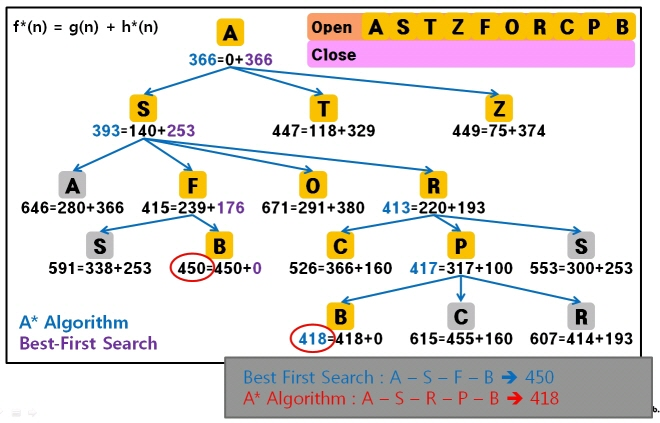

# Best First Search

# Best First Search

---

- Best-first search uses an evaluation function (sometimes called a "heuristic") to determine which object is the most promising, and then examines this object. This "best first" behavior is implemented with a Priority Queue. (unlike DFS or BFS (which blindly examines/expands a cell without knowing anything about it or its properties))

- 출발노드에서 시작해서 목표노드까지 도달하는 최적의 경로를 탐색하는 것은 보장되지 않음 → 방안: A* algorithm