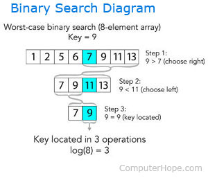

- A binary search comes with the prerequisite that the data must be sorted. (If data structure is complete binary search tree, then PERFECT!)
- Just remember that sorting data, even with the most efficient algorithm, will always be slower than a linear search (the fastest sorting algorithms are O(n * log n)).
- Check middle element, Recursively search 1 subarray
- `T(n) = T(n/2) + O(1) = O(logn)`



    ```cpp
    #include <iostream>
    using namespace std;
    
    bool BinarySearch(int arr[], int key, int low, int high)
    {
        if (low <= high)
        {
            int middle = (low + high) / 2; // 5
            cout << "middle) " << arr[middle] << endl;
            if (key == arr[middle])
                return true;
            if (key < arr[middle]) // 2 < arr[4] = 5
                return BinarySearch(arr, key, low, middle-1);
            if (key > arr[middle]) // 7 > arr[4] = 5
                return BinarySearch(arr, key, middle + 1, high);
        }
    
        return false;
    }
    
    int main ()
    {   
        int arr[10] = {1, 2, 3, 4, 5, 6, 7, 8, 9, 10};
        cout << BinarySearch(arr, 3, 0, 9) << endl;
        cout << BinarySearch(arr, 11, 0, 9) << endl;
    }
    ```