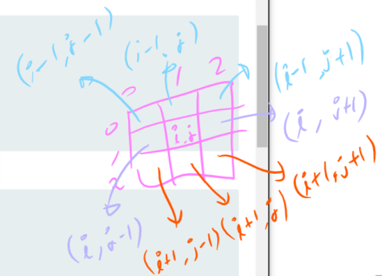

---
endTime: Jan 22, 2020 12:19 AM
startTime: Jan 22, 2020 12:05 AM
tag: Programming, Algorithm
title: 2D Array - DS
--- 

## Q. 2D Array에 모래시계의 형태의 sub array를 찾고, calculate the hourglass sum for every hourglass in arr, then print the maximum hourglass sum.



	```cpp
    // input is 6x6 array
    #include <iostream>
    using namespace std;
    
    template<size_t sizeI, size_t sizeJ>
    int findHourglassSumMax(int (&arr)[sizeI][sizeJ])
    {
    	int max = 0;	
    	// loop start from i = 1, j = 1
    	// end at i = sizeI - 2, j = sizeJ - 2; 
    	// => don't care about peripheral(? outer most indices)
    	// iteratively solve this question
    	/*
    	arr[i - 1][j - 1]
    	arr[i - 1][j]
    	arr[i - 1][j + 1]
    	arr[i][j] // <- std point
    	arr[i + 1][j - 1]
    	arr[i + 1][j]
    	arr[i + 1][j + 1]
    */
    	for (int i = 1; i < sizeI - 1; ++i)
    	{
    		for (int j = 1; j < sizej - 1; ++j)
    		{
    			if (arr[i][j] == 0)
    				continue;
    			int sum = arr[i - 1][j - 1]
    								+ arr[i - 1][j]
    								+	arr[i - 1][j + 1]
    								+ arr[i][j] // <- std point
    								+ arr[i + 1][j - 1]
    								+ arr[i + 1][j]
    								+ arr[i + 1][j + 1];
    			cout << sum << endl;
    			max = max < sum ? sum : max;
    		} 
    	}
    	return max;
    }
    
    int main()
    {
    	int arr[][] = {
    								{-9, -9, -9,  1, 1, 1},
    								{ 0, -9,  0,  4, 3, 2},
    								{-9, -9, -9,  1, 2, 3},
    								{ 0,  0,  8,  6, 6, 0},
    								{ 0,  0,  0, -2, 0, 0},
    								{ 0,  0,  1,  2, 4, 0}
    	};
    
    	cout << findHourglassSumMax<6, 6>(arr) << endl;
    
    	return 0;
    }
	```