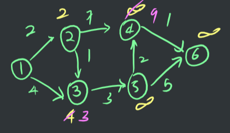

# Dijkstra Algorithm

# Description : 노드와 연결되어 있는 엣지의 비용과 현재까지의 비용의 합이 최소인 엣지를 선택

- Greedy Method
- Relaxation (nodes are relaxed)

- `if (d[u] + c(u, v) < d[v])`
- `d[v] = d[u] + c(u, v)`
- Time Complexity : `O(|v|^2)`
- drawback : may or may not work if a graph has negative edges

    vector<vector<int>> edge;
    vector<vector<int>> dist;
    
    int dijkstra(int from, int to, int v)
    {
    	int MAX = (int)1e9;
    	int d[v]; // 연결한 정점으로부터의 거리를 저장하는 배열
    	bool check[v]; // 이미 연결했는지 여부를 확인하는 배열
    	for (int i = 0; i < v; ++i)
    	{
    		d[i] = MAX;
    		check[i] = false;
    	}
    	d[from] = 0; 
    	
    	for (int i = 0; i < v; ++i)
    	{
    		int now = 0; // 탐색하지 않은 정점 중 가장 가까운 정점을 now에 추가한다.
    		int nowd = MAX;
    		for (int j = 0; j < v; ++j)
    		{
    			if (nowd > d[j] && !check[j])
    			{
    				nowd = d[j];
    				now = j;
    			}
    		}
    
    		if (nowd == MAX) 
    			break;
    
    		check[now] = true;
    		for (int j = 0; j < edge[now].size(); ++j)
    		{
    			int next = edge[now][j];
    			int nextd = d[now] + dist[now][j];
    			if (nextd < d[next])
    				d[next] = nextd;
    		}
    	}
    	return d[to];
    }