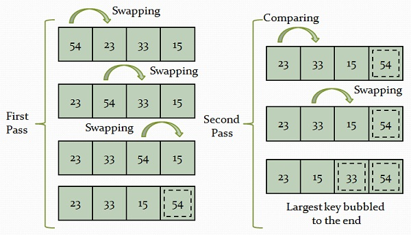

# Description : 인접한 두 원소를 비교해가면서 정렬하는 방식

- In the bubble sort, each element and its adjacent element is compared and swapped if required.



- Time Complexity : `O(n^2)`
- The slowest sorting algorithm
	```cpp
	#include <iostream>
	using namespace std;
	
	template <size_t size>
	void BubbleSort(int (&arr)[size])
	{
		for (int i = 0; i < size; ++i)
		{
			for (int j = i + 1; j < size; ++j)
			{
				if(arr[i] > arr[j])
				{
					int temp = arr[i];
					arr[i] = arr[j];
					arr[j] = temp;
				} 
			}
		}
	}
	
	int main()
	{
		int arr[6] = {3, 4, 2, 5, 6, 1};
		BubbleSort<6>(arr);
		for(int i = 0; i < 6; ++i)
			cout << arr[i] << ","; 
	}
	```