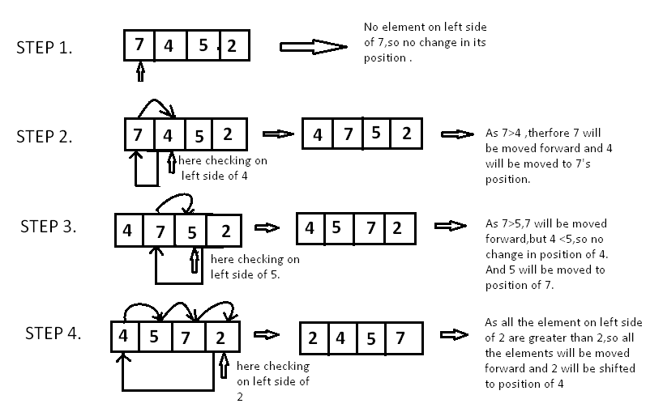

## Description : 정렬된 부분리스트에 원소를 삽입

---

- More efficient in practice than most other simple quadratic (i.e., `O(n^2)`) algorithms such as selection sort or bubble sort.



    ```cpp
    #include <string>
    #include <iostream>
    using namespace std;
    
    template <size_t size>
    void InsertionSort(int (&arr)[size])
    {
        int i = 0, key = 0, j = 0;
        for (int i = 1 ; i < size; ++i)
        {
            key = arr[i]; // key = 4 | 5
            j = i - 1; // j = 0 | 1
            while(j >= 0 && arr[j] > key) // 5 > 4 | 5 > 3 | 4 > 3
            {
                arr[j+1] = arr[j]; // 5,5,3 | 4,5,5 * 4,4,5
                j = j - 1; // -1 | 0 * -1 |
            }
            arr[j+1] = key; // 4,5,3 | 3,4,5
        }
    }
    
    int main()
    {
        int temp[3] = { 5, 4, 3};
        InsertionSort<3>(temp);
        for(auto i : temp)
        {
            cout << i << endl;
        }
        return 0;
    }
    ```