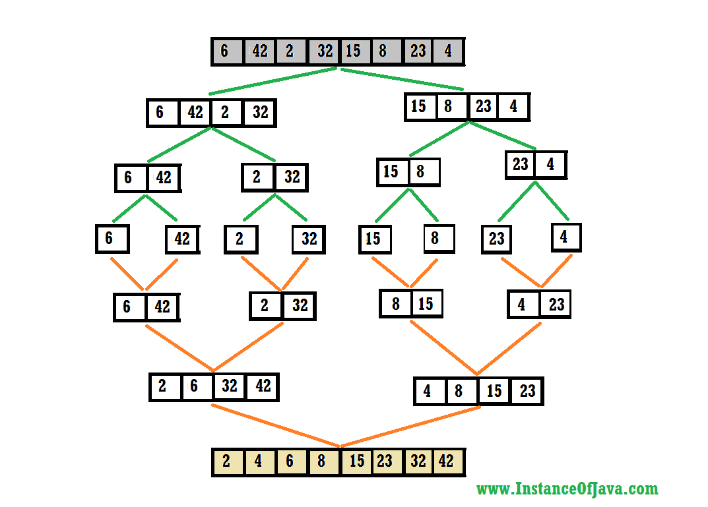

## Description : 정렬되지 않은 리스트를 나눠 재귀적으로 병합하여 정렬

---

- In practice, merge sort beats insertion sort when n > 30
- Preference : Unlike array, in **linked list**, we can insert items in the middle in O(1) extra space and O(1) time.
- Therefore merge operation of merge sort can be implemented without extra space for linked lists.
- So, in case of sorting linked list, Merge Sort is preferred over Quick Sort.
- It's pretty expensive to do random access in linked list, and **Merge Sort accesses data sequentially and the need of random access is low compared to Quick Sort**.
- Recursively sort 2 subarrays
- Linear-time merge
- `T(n) = 2T(n/2) + O(n) = O(nlogn)`



    ```cpp
    #include <iostream>
    using namespace std;
    
    void merge(int * arr, int * helper, int low, int mid, int high) {
      cout << "merge) low:" << low << ", high:" << high << endl;
      for (int i = low; i <= high; ++i) {
        helper[i] = arr[i];
        cout << i << " => " << helper[i] << endl;
      }
    
      int helperleft = low;
      int helperright = mid + 1;
      int cur = low;
    
      while (helperleft <= mid && helperright <= high) {
        if (helper[helperleft] <= helper[helperright]) {
          arr[cur] = helper[helperleft];
          ++helperleft;
        } else {
          arr[cur] = helper[helperright];
          ++helperright;
        }
        ++cur;
      }
    
      int remain = mid - helperleft;
      for (int i = 0; i <= remain; ++i) {
        arr[i + cur] = helper[helperleft + i];
        cout << "remain:" << remain << ", arr[" << i + cur << "]=" << arr[i + cur] << endl;
      }
    }
    
    void mergesort(int * arr, int * helper, int low, int high) {
      cout << "mergesort) low:" << low << ", high:" << high << endl;
      if (low >= high)
        return;
      int middle = (low + high) / 2;
      mergesort(arr, helper, low, middle);
      mergesort(arr, helper, middle + 1, high);
      merge(arr, helper, low, middle, high);
    }
    
    void mergesort(int * arr, int size) {
      int helper[size] {};
      mergesort(arr, helper, 0, size - 1);
    }
    
    int main() {
      int arr[6] = {0, 1, 5, 3, 4, 2};
      mergesort(arr, 6);
      for (int i = 0; i < sizeof(arr) / sizeof(int); ++i)
        cout << arr[i] << endl;
    }
    ```