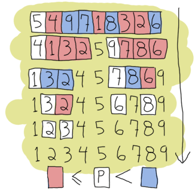

## Description : 피벗을 정한후, 피벗앞/뒤를 나눈다. (partitioning) 분할된 서브리스트에 대해 재귀 반복

---

- Quick Sort is a Divide and Conquer algorithm. It picks an element as pivot and partitions the given array around the picked pivot.
- **Preference** : Quick Sort is generally preferred over Merge Sort for **sorting arrays** b/c it is an in-place sort (i.e. ***it doesn’t require any extra storage***) whereas merge sort requires O(N) extra storage, N denoting the array size which may be quite expensive.
- It also exhibits ***good cache locality*** too.
- Time Complexity : 평균적으로 `O(nlogn)`
- But  `O(n^2)`
    1. when the list is already in sorted order
    2. when the list is in reverse sorted order


	```cpp
    #include <iostream>
    using namespace std;
    
    void Swap(int &a, int &b)
    {
    	int temp = a;
    	a = b;
    	b = temp;
    }
    
    template<size_t size>
    void QuickSort(int (&arr)[size], int low, int high)
    {
    	int i = low, j = high;
    	int pivot = arr[(low + high) / 2];
    	
    	while (i <= j)
    	{
    		while (arr[i] < pivot)
    			i++;
    		while (arr[j] > pivot)
    			j--;
    		if (i <= j)
    		{
    			Swap(arr[i], arr[j]);
    			i++;
    			j--;
    		}
    	}
    
    	if (low < j)
    		QuickSort<size>(arr, low, j);
    	if (i < high)
    		QuickSort<size>(arr, i, high);
    }
    
    int main()
    {
    	int arr[9] = {5, 4, 9, 7, 1, 8, 3, 2, 6};
    	QuickSort<9>(arr, 0, 8);
    	for(auto i : arr)
    		cout << i << ", ";
    }
	```