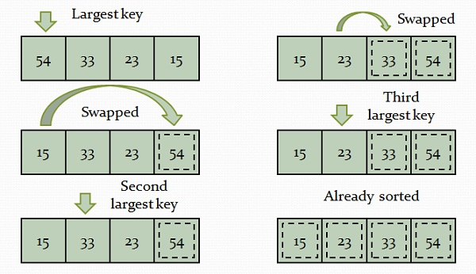

# Description : 한번 순회를 하면서 가장 큰 수를 찾아서 배열의 마지막 위치와 교환

---

- Selection sort works by selecting the element and swapping that particular element with the last element.
- The selected element could be largest or smallest depending on the order i.e., ascending or descending.



- Time Complexity : `O(n^2)`
- Slightly better than Bubble sort

	```cpp
    #include <iostream>
    using namespace std;
    
    template <size_t size>
    void SelectionSort(int (&arr)[size])
    {
    	for (int i = 0; i < size; ++i)
    	{
    		for (int j = i + 1; j < size; ++j)
    		{
    			if(arr[i] > arr[j])
    			{
    				int temp = arr[i];
    				arr[i] = arr[j];
    				arr[j] = temp;
    			} 
    		}
    	}
    }
    
    int main()
    {
    	int arr[6] = {3, 4, 2, 5, 6, 1};
    	SelectionSort<6>(arr);
    	for(int i = 0; i < 6; ++i)
    	{
    		cout << arr[i] << ","; 
    	}
    }
	```