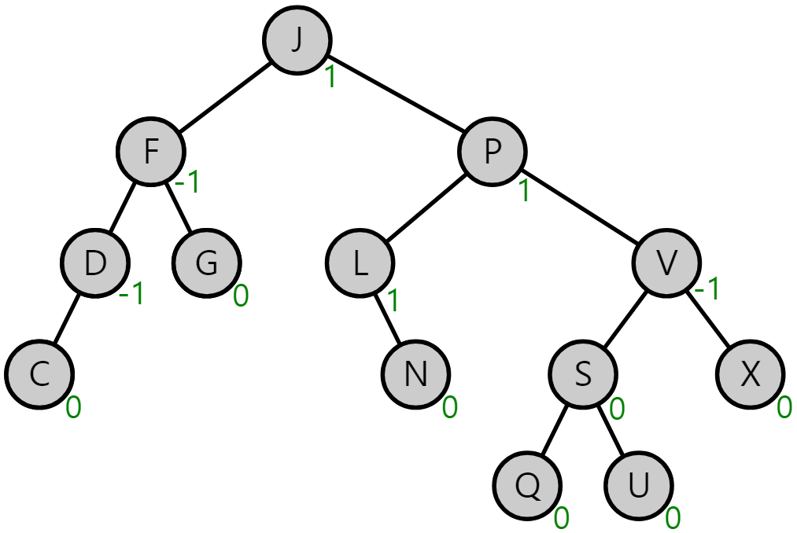
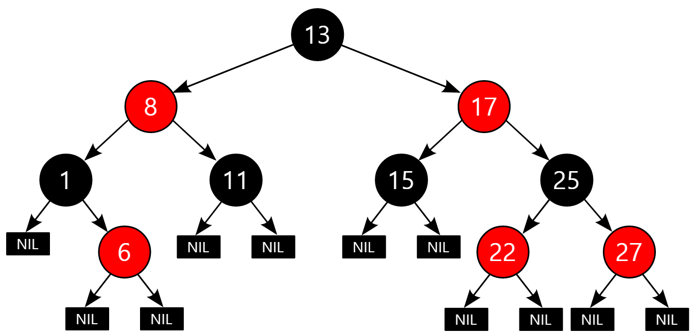

## Description : an ordered binary tree

- 예) 왼쪽 자식 노드는 노드의 값보다 작은값, 오른쪽노드는 큰값
- Insertion / Deletion `O(log(n))`
- Search `O(log(n))`
    ```cpp
    #include <iostream>
    using namespace std;
    
    template <typename T> class Node
    {
    	friend class BinarySearchTree<T>;
    
    public:
    	Node() : left(nullptr), right(nullptr) {}
    	Node(T t) : data(t), left(nullptr), right(nullptr) {}
    
    private:
    	T data;
    	Node* left;
    	Node* right;
    };
    
    template <typename T> class BinarySearchTree
    {
    public:
    	BinarySearchTree<T>() : root(nullptr) {}
    	~BinarySearchTree<T>() { if (!isEmpty()) delete root; }
    	
    	int compare(const T& a, const T& b);
    
    	bool search(T value, function<int(T&, T&)>& comp);
    	bool remove(T value, function<int(T&, T&)>& comp);
    	bool removeHelper(Node<T>*& currentNode, T value, function<int(T&, T&)>& comp);
    	bool insert(T value, function<int(T&, T&)>& comp);
    	bool insertHelper(Node<T>*& currentNode,T value, function<int(T&, T&)>& comp);
    	bool isEmpty();
    	
    private:
    	Node<T>* root;
    };
    
    template <typename T>
    int BinarySearchTree<T>::compare(const T& a, const T& b)
    {
    	if (a == b) return 0;
    	if (a > b) return 1;
    	return -1;
    }
    
    template <typename T>
    Node<T>* BinarySearchTree<T>::search(T value, function<int(T&, T&)>& comp)
    {
    	Node<T>* currentNode = root;
    	while (currentNode)
    	{
    		if (0 == comp(currentNode->data, value)) return currentNode;
    		else if (1 == comp(value, current->data)) currentNode = currentNode->
    	}
    	return nullPtr;
    }
    
    template <typename T>
    bool BinarySearchTree<T>::remove(T value, function<int(T&, T&)>& comp)
    {
    	
    }
    
    template <typename T>
    bool BinarySearchTree<T>::removeHelper(Node<T>*& currentNode, T value, function<int(T&, T&)>& comp)
    {
    	
    }
    
    template <typename T>
    bool BinarySearchTree<T>::insert(T value, function<int(T&, T&)>& comp)
    {
    	
    }
    
    template <typename T>
    bool BinarySearchTree<T>::insertHelper(Node<T>*& currentNode, T value, function<int(T&, T&)>& comp)
    {
    	
    }
    
    template <typename T>
    bool BinarySearchTree<T>::isEmpty()
    {
    	
    }
    
    int main()
    {
    
    }
    ```
---

# Self-balancing BST

## 1. AVL Tree

- 왼쪽 서브트리의 깊이를 `hl`, 오른쪽 서브트리의 깊이를 `hr`이라 할때, `hl - hr` 의 값이 -`1, 0, 1`이되도록 변경
- Space Complexity `O(n)`
- Insertion / Deletion `O(log(n))`



## 2. Red-Black Tree

- 2-3-4 tree와 유사
- 노드는 red/black이며 루트와 모든leaf는 블랙, red노드의 자식은 모두 black
- 리프노드에 traversal할때 블랙노드의 수는 같음
- Space Complexity `O(n)`
- Insertion / Deletion `O(log(n))`
- *AVL Tree가 더욱 엄격함. RB tree가 더 효율적이다.*

