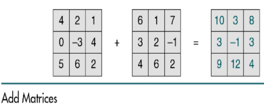
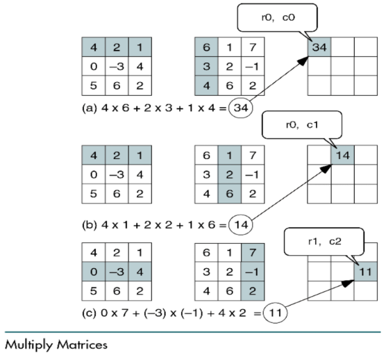

# Q. Add Matrices





```cpp
#include <iostream>

using namespace std;

template <size_t size>
void addMatrix(int (&m1)[size][size], int (&m2)[size][size], int (&result)[size][size]) 
{
	for (int i = 0; i < size; ++i) 
	{
		for (int j = 0; j < size; ++j) 
		{
			result[i][j] = m1[i][j] + m2[i][j];
		}
	}
}

template <size_t size>
void multiplyMatrix(int (&m1)[size][size], int (&m2)[size][size], int (&result)[size][size]) 
{
	int row = 0;
	while(row < size) 
	{
		for (int i = 0; i < size; ++i) 
		{
			for (int j = 0; j < size; ++j) 
			{
				result[row][i] += m1[row][j] * m2[j][i];
			}
		}
		row++;
	}
}

template <size_t size>
void printMatrix(int (&m)[size][size]) 
{
	for (int i = 0; i < size; ++i) 
	{
		for (int j = 0; j < size; ++j) 
		{
			cout << m[i][j] << endl;
		}
		cout << endl;
	}
}

int main() {
	int m1[3][3] = {{4, 2, 1}, {0, -3, 4}, {5, 6, 2}};
	int m2[3][3] = {{6, 1, 7}, {3, 2, -1}, {4, 6, 2}};

	int result[3][3] = {{}};
	addMatrix<3>(m1, m2, result);
	printMatrix(result);
}
```