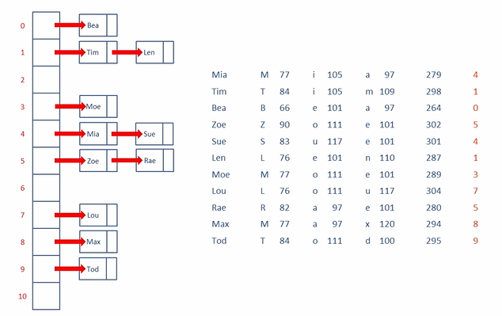

## Description : A data structure that can map keys to values (Hash Code Function)

- **Two ways to implement :**
    1. Linked List
        - Worst case `O(n)` for search
        - But usually `O(1)` for search, if Collision(e.g. `44 % 11 == 0` , `77 % 11 == 0`) is minimized
    2. Binary Search Tree
        - Worst case `O(logn)` for search
        - 크기가 큰 배열을 미리 할당하지 않아도 됨 OR 배열을 resize(takes `O(n)`)하지 않아도 됨
        - 키의 집합을 특정 순서에 따라 차례대로 접근 가능함
- Resize `O(n)`
- Insert `O(n)`
- delete `O(n)`
- **Collision 해결 방법 :**
    1. Chaining
        - Linked list를 이용한 chaining → Data를 그냥 linked list에 추가 : `O(n)` Search

        

        - Binary Search Tree를 이용한 chaining → Data를 Binary Search Tree에 저장 : `O(logn)` Search Time
            - But, 데이터가 극단적으로 균일하게 분포되어있지 않으면 이 방법을 사용하면 안 됨
    2. Open Addressing 
        - Linear Probing : Find Next Available Slot → Result in Clustering
        - Plus 3 Rehash
        - Quadratic Probing
        - Double Hashing
        - Quadratic Hashing
- **Key의 Hash Code 계산**
    - Hash Code를 이용, 배열의 index를 구함
    - Key가 `int, long`이면 유한하니까, 서로 다른 두 개의 키가 같은 Hash code를 가질 수 있음
    - `Hash(key) % length of array`

	```cpp
    // linked list
    // chaining을 사용(for collision resolution)한 implementation
    #include <iostream>
    using namespace std;
    
    static const int TABLE_SIZE = 10;
    
    template <typename K, typename V> class HashNode
    {
    public:
    	HashNode(const K &key, const V &value) : key(key), value(value), next(NULL) {}
    
    	K getKey() const { return key; }
    	V getValue() const { return value; }
    
    	void setValue(V value) { this->value = value; }
    
    	HashNode *getNext() const { return next; }
    	void setNext(HashNode* next) { this->next = next; }
    
    private:
    	K key;
    	V value;
    	HashNode *next; // next bucket with the same key
    };
    
    template <typename K> struct KeyHash 
    {
    	unsigned long operator()(const K& key) const 
    	{ 
    		return (unsigned long)(key) % TABLE_SIZE; 
    	}
    };
    
    template <typename K, typename V, typename F = KeyHash<K>> class HashMap
    {
    public:
    	HashMap() { table = new HashNode<K, V> *[TABLE_SIZE](); }
    	~HashMap() // destroy all buckets one by one
    	{ 
    		for (int i = 0; i < TABLE_SIZE; ++i)
    		{
    			HashNode<K,V> *entry = table[i];
    			while(entry != NULL)
    			{
    				HashNode<K, V> *prev = entry;
    				entry = entry->getNext();
    				delete prev;
    			}
    			table[i] = NULL;
    		}
    
    		delete [] table; // destroy the hash table
    	}
    
    	bool get(const K &key, V &value)
    	{
    		unsigned long hashValue = hashFunc(key);
    		HashNode<K, V> *entry = table[hashValue];
    		while(entry != NULL)
    		{
    			if (entry->getKey() == key)
    			{
    				value = entry->getValue();
    				return true;
    			}
    			entry = entry->getNext();
    		}
    
    		return false;
    	}
    
    	void insert(const K &key, const V &value)
    	{
    		unsigned long hashValue = hashFunc(key);
    		HashNode<K, V> *prev = NULL;
    		HashNode<K, V> *entry = table[hashValue];
    
    		while (entry != NULL && entry->getKey() != key)
    		{
    			prev = entry;
    			entry = entry->getNext();
    		}
    
    		if (entry == NULL)
    		{
    			entry = new HashNode<K, V>(key, value);
    			if (prev == NULL)
    				table[hashValue] = entry;
    			else
    				prev->setNext(entry);
    		}
    		else
    			entry->setValue(value); // just update the value
    	}
    
    	void remove(const K &key) 
    	{
    		unsigned long hashValue = hashFunc(key);
    		HashNode<K, V> *prev = NULL;
    		HashNode<K, V> *entry = table[hashValue];
    		while (entry != NULL && entry->getKey() != key)
    		{
    			prev = entry;
    			entry = entry->getNext();
    		}
    
    		if (entry == NULL) // key not found
    			return;
    		else
    		{
    			if (prev == NULL)
    				table[hashValue] = entry->getNext(); // remove first bucket of the list
    			else
    				prev->setNext(entry->getNext());
    			delete entry;
    		}
    	}
    
    private:
    	HashNode<K, V> **table;
    	F hashFunc;
    };
    
    int main()
    {
    	HashMap<int, string> hMap;
    	hMap.insert(3, "val3");
    	hMap.insert(2, "val2");
    	hMap.insert(1, "val1");
    
    	string valStr;
    	bool result = hMap.get(3, valStr);	
    	cout << result << endl;
    	
    	hMap.remove(3);	
    	result = hMap.get(3, valStr);	
    	cout << result << endl;
    	
    	hMap.get(2, valStr);
    	cout << valStr << endl;
    
    	return 0;
    }
	```	