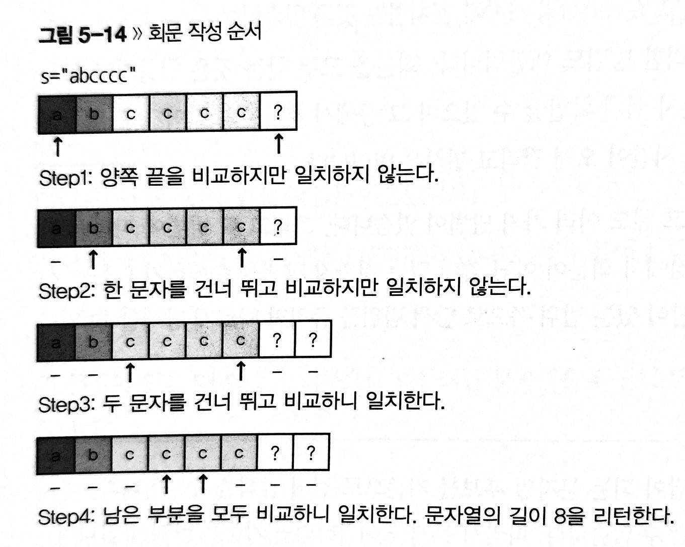

# Tips

- `bool isSubstring = str1.find(s2) != string::npos;`

---

# Q. Making Anagrams

- We consider two strings to be anagrams of each other if the first string's letters can be rearranged to form the second string. 
In other words, both strings must contain the same exact letters in the same exact frequency.

       For example, 'bacdc' and 'dcbac' are anagrams, but 'bacdc' and 'dcbad' are not.

- Make Two Strings Anagram.
- The first line contains string s1.
- The second line contains string s2.

    ```cpp
    using namespace std;
    
    int makingAnagrams(string s1, string s2) {
        map<char, int> s1Map;
        map<char, int> s2Map;
        for (auto c : s1)
        {
            if (s1Map.find(c) != s1Map.end())
                s1Map[c]++;
            else
                s1Map.insert(pair<char, int>(c, 1));
        }
        for (auto c : s2)
        {
            if (s2Map.find(c) != s2Map.end())
                s2Map[c]++;
            else
                s2Map.insert(pair<char, int>(c, 1));
        }
        
        // ssbca -> s:2 b:1 c:1 a:1 -> s:1 b:0 c:1 a:0
        // sbaa -> s:1 b:1 a:2 -> s:0 b:0 a:1
        int result = 0;
        for (auto p : s1Map)
        {
            if (s2Map.find(p.first) != s2Map.end())
            {
                int temp = s2Map[p.first];
                s2Map[p.first] = max(0, s2Map[p.first] - p.second);           
                s1Map[p.first] = max(0, p.second - temp);
            }
        }
         
        for (auto p : s1Map)
        {
            result += p.second;
        }
        for (auto p : s2Map)
        {
            result += p.second;
        }
        return result;
    }
    
    int main()
    {
        string s1;
        getline(cin, s1);
        string s2;
        getline(cin, s2);
    
        int result = makingAnagrams(s1, s2);
        cout << result << "\n";
    
        return 0;
    }
    ```
---

# Q. Anagram Pattern Search

- Find permutations of pattern within string (Anagram substring search)
- e.g. pattern = 'abbc' / string = 'babcabbacaabcbabcacbb'
1. make a list of anagrams 
2. iterate through string and determine whether string[index] ~ string[index + size of pattern] matches any item in a list of anagrams 
3. base case 
    1. if the size of string is smaller than the size of pattern then return 0
    2. may be unnecessary - if the size of string is the same as the size of pattern, then just compare each characters in two strings and if it matches then return 1

    ```cpp
    #include <map>
    #include <iostream>

    using namespace std;
    
    template<typename T> void show(map<T, int> mp)
    {
        for(auto p : mp)
            cout << "  " << p.first << ", " << p.second << endl;
        cout << endl;
    }
    
    template<typename T, size_t N1, size_t N2>
    int AnagramPatternSearch(T (&pattern)[N1], T (&str)[N2])
    {
        if (N1 > N2)
            return 0;
    
        map<T, int> pMap;
        for (auto c : pattern) // O(N1)
        {
            if ((c >= 'A' && c <= 'Z') || (c >= 'a' && c <= 'z'))
            {
                if (pMap.find(c) == pMap.end())
                    pMap.insert(make_pair(c, 1));
                else
                    pMap[c]++;
            }
        }
    
    	    int count = 0;
        for (int i = 0; i < N2 - N1 + 1 ; ++i) // O(N1 * N2)
        {
            map<T, int> sMap;
            for (int j = i; j < i + N1 - 1; ++j)
            {
                if (sMap.find(str[j]) == sMap.end())
                    sMap.insert(make_pair(str[j], 1));
                else
                    sMap[str[j]]++;
            }
    
            show<T>(sMap);
    
            if (pMap == sMap)
                count++;
        }
        return count;
    }
    
    int main()
    {
        char pattern[4] = "aba"; // 3
        char str[9] = "aabdbaac"; // 8 - 3 + 1 = 6 > i까지는... 9 - 4 + 1= 6 
        cout << AnagramPatternSearch<char, 4, 9>(pattern, str) << endl; // 2
    
        char pattern2[4] = "aba";
        char str2[4] = "aab";
        cout << AnagramPatternSearch<char, 4, 4>(pattern2, str2) << endl; // 1
    }
    ```

---

# Q. Palindrome



```cpp
#include <string>
#include <iostream>
using namespace std;

class Palindrome
{
public:
    int find(string s) 
    {
        for (int i = s.size(); ; ++i) 
        {
            bool flag = true;
            for (int j = 0; j < s.size(); ++j) 
            {
                if ((i - j - 1) < s.size() && s[j] != s[i - j - 1]) 
                {
                    flag = false;
                    break;
                }
            }
            if (flag)
                return i;
        }
    }
};

int main()
{
    string s = "helle";
    Palindrome p;
    cout << p.find(s);
    return 0;
}
```

# Q. Make Palindrome by reduce by 1

- only reduce the value of a letter by , i.e. you can change d to c, but you cannot change c to d or d to b.

    ```cpp
    int theLoveLetterMystery(string s)
    {
        int middle = s.size()/2;
        int count = 0;
        // string = "abdc"
        // i = 0 / 1
        // j = 3 / 2
        // middle = 2
        // count = 1 / 2 / 3 / 4 / 5
        for (int i = 0, j = s.size() - 1; i < middle && j >= middle; ++i, --j)
        {
            while(true)
            {// a < c -> a < b -> a == b // b < d -> b < c -> b == b
                if (s[i] == s[j])
                {
                    break;
                }
                else if (s[i] > s[j])
                {
                    count++; 
                    --s[i];
                }
                else if (s[i] < s[j])
                {
                    count++; 
                    --s[j];
                }
            }
        }
        return count;
    }
    ```
