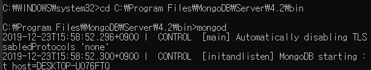

# Backend 맛보기 - 2

## MongoDB

- NoSQL DBMS
- C++로 작성된 오픈소스 Document Oriented Database
    - Document: `{key: value}` 집합
    - Collection: document 집합
    - Database: Collection 집합

        {
        	"_id" : ObjectId("1"), /* 12 bytes의 hexadecimal 값, document의 unique함 제공 */
        	"name" : "A",
        	"gender" : "F",
        	"age" : "20",
        	"phone" : "010-0000-0000"
        }
        {
        	"_id" : ObjectId("2"),
        	"name" : "B",
        	"gender" : "M",
        	"age" : "21"
        }

1. cmd창이나 터미널에서 `C:\Program Files\MongoDB\Server\4.2\bin` 폴더 접근 후 `mongod` 명령어로 서버 실행

    

2. `mongo` 명령어 실행으로 클라이언트 접근

    

3. database 사용법 익히기

    ## Database 조작

    - 사용할 database 선택: `use mongodb_tutorial`
    - 현재 database 목록 보기: `show dbs`
        - data가 없는 database는 목록에서 보여지지 않음

        

    - 선택된 database 제거: `db.dropDatabase();`

        

    ---

    ## Collection 조작

    - 선택된 database에 collection 생성: `db.createCollection("books", <option>fjuston);`
        - option 종류
            - `<capped>`: collection size 설정 여부
            - `<size>`: collection size 설정
            - `<max>`: document 개수 제한 설정
            - etc...

        

    - 선택된 database의 collection 목록 보기: `show collections`

        

    - 선택된 database에 collection 제거: `db.people.drop();`

        

    ---

    ## Document 조작

    - 선택된 database, sample collection에 document 삽입
        - 하나 삽입: `db.sample.insertOne({"name": "sample"});`

            

        - 여러개 삽입: `db.books.insertMany([{"name": "Book of A", "author": "A"}, {"name": "Book of B", "author": "B"}]);`

            

        Tip: collection이 미리 만들어있지 않아도 자동으로 collection 생성됨

    - 선택된 database, books collection에서 document 검색: `db.books.find(<query>, <projection>);` or `db.books.find().pretty();`

        

    - 선택된 database, books collection에서 document 제거: `db.books.remove({"name": "Book of A"}, [true|false]);`
        - `<justOne>` option을 true로 주면 조건이 만족하는 document 중 하나만을 삭제, false면 모든 document 삭제

        

    ---