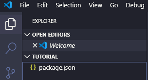

# VS Code 프로젝트 생성

1. 원하는 곳에 프로젝트 폴더 생성
2. cmd창이나 터미널에서 해당 폴더에 들어가 `npm init` 실행, enter로 빠져나옴
3. VS Code에서 해당 폴더를 open하여 package.json이 있는지 확인

    

4. 다시 cmd창이나 터미널로 들어가서 Dependency 및 Plugin 설치
    - `npm install --save react react-dom` 명령어 실행
        - 아래 빨간 부분이 package.json에 추가됨 (⇒ `--save` 명령어)

        

    - `npm install --save-dev babel-core babel-loader@7 babel-preset-es2015 babel-preset-react` 명령어 실행
        - ES6 문법, JSX를 인식할 수 있게 하는 Babel 컴파일러 설치
    - `npm install --save-dev react-hot-loader webpack webpack-dev-server` 명령어 실행
        - webpack hot-loader를 로컬에 설치

    

    - `npm install -d webpack-cli` 명령어 실행

    혹시라도 eslint extension 실행에 문제가 있다면 `npm install -g eslint` 명령어 실행으로 글로벌하게 설치해줌

5. webpack.config.js 작성
    ```javascript
    var webpack = require('webpack'); /* webpack 불러오기*/
    
    module.exports = { /* 해당 객체를 모듈로 내보내겠다 */
        entry: './src/index.js',
        output: { /* 합친 파일들을 public(output 폴더)에 저장 */
            path: __dirname + '/public/',
            filename: 'bundle.js'
        },
        devServer: {
            hot: true, /* enable hot reloader */ 
            inline: true, /* hot reload에 필요한 webpack dev server의 client를 bundle에 포함 */
            host: '0.0.0.0',
            port: 4000,
            contentBase: __dirname + '/public', /* index 파일 위치 */
        },
    
        module: {
            rules: [
                {
                    test: /\.js$/,
                    loader: 'babel-loader',
                    exclude: /node_modules/,
                    query: {
                        cacheDirectory: true,
                        presets: ['es2015', 'react']
                    }
                }
            ]
        },
    
        plugins: [
            new webpack.HotModuleReplacementPlugin()
        ]
    };
    ```
6. src/components/App.js 작성
    ```javascript
    import React from 'react';

    class App extends React.Component {
        render() {
            return (
                <h1>Hello World</h1>
            );
        }
    }

    export default App;
    ```
7. public/index.html 작성
    ```javascript
    <!DOCTYPE html>
    <html>
        <head>
            <meta charset='UTF-8'>
            <title>React App</title>
        </head>
        <body>
            <div id='root'></div>
            <script src='bundle.js'></script>
        </body>
    </html>
    ```
8. src/index.js 작성
    ```javascript
    import React from 'react';
    import ReactDOM from 'react-dom';
    import App from './components/App';
    
    const rootElement = document.getElementById('root');
    ReactDOM.render(<App/>, rootElement);
    ```
9. package.json에 실행 스크립트 추가
    ```javascript
    "scripts": {
    "test": "echo \"Error: no test specified\" && exit 1",
    "dev-server": "webpack-dev-server"
    },
    ```
10. `npm run dev-server` 명령어 실행

    

11. [localhost:4000](http://localhost:4000)에서 실행 결과 확인

    