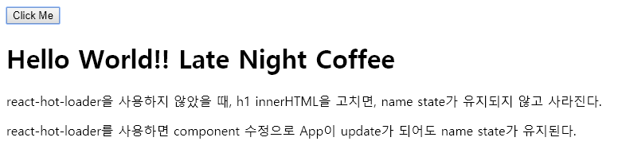

# React-hot-loader

- 기본적으로 서버 가동 중에 코드가 변경되면, 모든 페이지가 새로고침 됨.
- hot module replacement를 사용하면, 수정된 파일만 reloading함
- 다만, webpack이 어떤 상황에 어떤 page를 reload해야하는지 모르기 떄문에 설정 필요 →  `module.hot.accept();`을 사용
    - problem: local state를 유지시키지 않음 → react-hot-loader를 webpack에 적용
    - 주의할 점: local state를 유지시킨다는 말은 constructor를 실행시키지 않는다는 뜻 → 즉, constructor를 수정하게되면 F5로 browser를 refresh 시켜야 함
- webpack.config.js
    ```javascript
    /*...*/
    module: {
            rules: [
                {
                    test: /\.js$/,
                    loader: 'babel-loader',
                    exclude: /node_modules/,
                    query: {
                        cacheDirectory: true,
                        presets: ['es2015', 'react'],
                        plugins: ['react-hot-loader/babel'] 
                    }
                }
            ]
        },
    /*...*/
    ```
- src/index.js    
    ```javascript
    import React from 'react';
    import ReactDOM from 'react-dom';
    import App from './components/App';
    
    const rootElement = document.getElementById('root');
    ReactDOM.render(<App/>, rootElement);
    
    /*
    if (module.hot) {
        module.hot.accept();
    }
    */
    ```
- src/components/App.js
    ```javascript
    import React from 'react';
    import { hot } from 'react-hot-loader/root'; /* react-hot-loader 사용 시 import 해줘야함 */
    
    class App extends React.Component {
        constructor(props) {
            super(props);
            this.state = {
                name: ''
            };
        }
        render() {
        return (
            <div>
                <button onClick = {() => {this.setState({name: 'Late Night Coffee'});}}>Click Me</button>
                <h1>Hello World!!! {this.state.name}</h1>
                <p>react-hot-loader을 사용하지 않았을 때, h1 innerHTML을 고치면, name state가 유지되지 않고 사라진다.</p>
                <p>react-hot-loader를 사용하면 component 수정으로 App이 update가 되어도 name state가 유지된다.</p>
            </div>
            );
        }
    };
    
    export default hot(App); /* react-hot-loader 사용 시 root component를 hot-exported로 변환해줘야함 */
    ```
    
    *변경 전*

    
    *module.hot.accpet() 적용으로 코드 변경 시 page가 refresh되진 않지만, local state는 유지되지 않음*

    
    *react-hot-loader 적용 후 코드 변경 시 state가 유지됨*