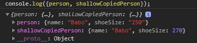

# Flux

- Facebook이 React에서 사용하기 위해 만들어진 Architecture (like MVC)

    							┌ㅡㅡㅡㅡActionㅡㅡㅡ-┐
    							↓										 |
    Action -> Dispatcher -> Store -> View
           ↓                       |
    			Dispatcher가 받은        |
    			Action을 통제하여        |
    			Store에 있는 Data를      ↓
    			업데이트함            변동된 Data가 있으면 
                                Subscribe하고 있는 
    														Controller View에 알려주고,
    														자식 View에게 rendering하라고 함

### Action

- 변경사항이나 인터렉션을 Dispatcher에 보내는 역할

### Dispatcher

- Action이 넘어오면, 여러 Store에 Action을 보내는 역할
- callback이 등록되어있음
- 동기적으로 실행됨

### Store

- 어플리케이션 상태와 로직을 관리하는 역할

### View

- 상태를 가져오고 화면을 렌더링하는 역할

---

# Redux

- FLUX Architecture를 *비슷하게* 구현한 라이브러리

    							┌ㅡㅡㅡActionㅡㅡㅡ┐
    							↓									|
    Action -> Store <-> Reducer -> View
           ↓                |
    			Store가 받은       |
    			Action을 통제하여  |
    			Reducer에 Data     | 
    			업데이트를 요청함   ↓   
    										Reducer는 Action을 받아
    										각 담당 Reducer가 처리하는데,
    										상태의 사본을 만들고 변경사항을 적용함
    										그리고 Store에게 상태를 줌

## 3가지 원칙

1. Single Source of Truth: Redux는 application의 state 관리를 위해 한 개의 store만을 사용 ↔ Flux는 여러개의 store 사용
2. State is Read-only: store의 state를 변경하기 위해선 무조건 action이 dispatch 되어야 함
3. Changes are made with Pure Functions: reducer는 pure function으로 작성되어야 함
    - reducer: action object를 처리하는 함수, reducer는 data를 받아서 state를 어떻게 업데이트할지 정의함 `(previousState, action) ⇒ newState`
    - pure function: 동일한 input이 주어지면, 항상 동일한 output을 반환하는 함수 / 외부의 상태를 변경하지 않는 함수

        아래와 같은 side-effect가 있으면, pure function이 아니다.

        1. input을 변경

                // impure하게 object를 바꾸는 방법
                const impureAssoc = (key, value, object) => {
                	object[key] = value;
                };
                
                const person = {
                	name: 'Babo'
                };
                
                const result = impureAssoc('shoeSize', 250, person);
                
                console.log({person, result}); // person: {name:'Babo', shoeSize:'250'}
                															 // result: undefined
                
                // pure하게 object를 바꾸는 방법 1.
                const pureAssoc = (key, value, object) => ({
                	...object,
                	[key]: value
                });
                
                const person = {
                	name: 'Babo'
                };
                
                const result = pureAssoc('shoeSize', 250, person);
                
                console.log({person, result}); // person: {name:'Babo'}
                															 // result: {name:'Babo', shoeSize:'250'}
                
                // pure하게 object를 바꾸는 방법 2.
                const pureAssoc2 = (key, value, object) => {
                	const newObj = {...object};
                	newObj[key] = value;
                	return newObj;
                };
                
                const person = {
                	name: 'Babo'
                };
                
                const result = pureAssoc2('shoeSize', 250, person);
                
                console.log({person, result}); // person: {name:'Babo'}
                															 // result: {name:'Babo', shoeSize:'250'}

            - `...`는 객체의 shallow copy를 수행함

                그 말인 즉슨 newObj와 object가 객체를 공유하는데, 다음과 같은 문제가 발생됨

                1. Property Descriptors가 복사되지 않음
                2. 프로토타입 체인 또는 열거 가능하지 않은 Property는 복사되지 않음
                3. 기본형 타입은 변경해도 서로 영향을 끼치지 않지만, 참조형 타입은 객체는 공유하고 있기 때문에 영향이 있음

                    // this is fine
                    const person = {
                    	name: 'Babo',
                    	shoeSize: '250'
                    };
                    
                    const shallowCopiedPerson = { ...person };
                    shallowCopiedPerson.shoeSize = 270;
                    
                    console.log({person, shallowCopiedPerson});

                

                shoeSize를 변경해도 person과 shallowCopiedPerson이 같은 값을 가지고 있진 않음

                    // this is not fine, because 'address' is an object.
                    const person = {
                    	name: 'Babo',
                    	address: { street: 'Liverpool St.', number: 123 }
                    };
                    
                    const shallowCopiedPerson = { ...person };
                    shallowCopiedPerson.address.number = 234;
                    
                    console.log({person, shallowCopiedPerson});

                

                address의 number를 바꾸면 person과 shallowCopiedPerson이 같은 값을 가지게 됨

                    // Deep copy 방법 1. JSON 방식
                    const person = {
                    	name: 'Babo',
                    	address: { street: 'Liverpool St.', number: 123 }
                    };
                    
                    // JSON 방식은 성능이 별로, 또한 function의 경우에는 undefined로 처리되어 좋지 못함, + 다른 단점들이 많음
                    const deepCopiedPerson = JSON.parse(JSON.stringify(person));
                    deepCopiedPerson.address.number = 234;
                    
                    console.log({person, deepCopiedPerson});
                    
                    // Deep copy 방법 2. jQuery 등을 사용하거나 clone function 하나 만듦

                

                person과 deepCopiedPerson 객체의 address.number 값이 다름

        2. `console.log()`

                // pure function
                const add = (x, y) => x + y;
                add(2, 4); // 6
                
                // non pure function 예 1. 동일하지 않은 output
                let x = 2;
                const add = (y) => {
                	x += y;	
                };
                add(4); // x === 6
                
                // non pure function 예 2. console.log 존재
                const impureDouble = (x) => { console.log('doubling', x); return x * 2; };
                const result = impureDouble(4);
                console.log({result});

        3. HTTP 호출 (AJAX/fetch) 같은 비동기 작업
        4. 파일시스템 변경
        5. DOM 쿼리

[Components 종류](Day8/Components.csv)

---

# Redux 설치

- `npm install -g create-react-app` 실행

    

- 폴더를 새로 만들고, 해당 폴더로 들어가 cmd창이나 터미널에 `create-react-app redux-example` 실행
- 설치가 완료되면, 설치가 된 폴더에 들어가 `npm start` 실행, [localhost:3000/](http://localhost:3000/에) 에 접속하여 정상적인지 확인

    

- 빠져나와서 필요한 모듈 설치 진행: `npm install --save redux react-redux` 실행
    - react-redux: view layer binding

---