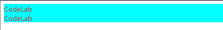
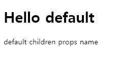
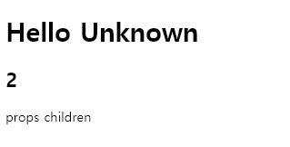
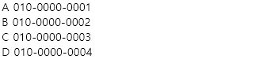

# JavaScript Expression
  ```javascript
  <div id="root"></div>

  class CodeLab extends React.Component {
    render() {
      /* Style 지정 시 camelCase 사용*/
      let style = {
        color:'red',
        backgroundColor:'aqua'
      };
      let text = "CodeLab";
      return (
        <!-- Component에서 여러 Element를 렌더링할 때 꼭 Container Element안에 포함시켜야 함 -->
        <div style={style}>
          {/* Comment 작성 법, div 안에서만 이렇게 사용 가능*/}
          CodeLab<br/>
          {text}
        </div>
      );
    }
  }
  
  class App extends React.Component {
    render() {
        return (
        <CodeLab/> <!-- CodeLab Component -->
        );
      }
  }
  
  /* ReactDOM는 실제 페이지에 JSX 형태의 코드를 렌더링할 때 사용됨 */
  /* 첫번째 인수 : 렌더링할 JSX 형태의 코드 */
  <!-- 두번째 인수 : Component를 렌더링할 Element -->
  ReactDOM.render(<App/>, document.getElementById("root"));
  ```
  

# props

- Component 내부의 Immutable Data를 표현할 때 쓰임
- `{this.props.propsName}`
- `{this.props.children}`
  ```javascript
  class CodeLab extends React.Component {
    render() {
      return (
        <div>
          <h1>Hello {this.props.name}</h1>
          <div>{this.props.children}</div>
        </div>
      );
    }
  }
  
  class App extends React.Component {
    render() {
        return (
        <CodeLab name={this.props.name}>{this.props.children}</CodeLab>
        );
      }
  }
  
  ReactDOM.render(<App name="my props name">children props name</App>, document.getElementById("root"));
  ```
  

- 기본 값 설정
    ```javascript
    <!-- props 기본 값 설정 방법 -->
    App.defaultProps = {
      children: "default children props name",
      name: "default"
    }
    
    ReactDOM.render(<App/>, document.getElementById("root"));
    ```
  

- Type Validation
    ```javascript
    *console창에 error가 떠야하나 왜 안 뜨는가?*

    class CodeLab extends React.Component {
      render() {
        return (
          <div>
    				<h1>Hello {this.props.name}</h1>
            <h2>{this.props.number}</h2>
            <div>{this.props.children}</div>
          </div>
        );
      }
    };
    
    class App extends React.Component {
      render() {
         return (
          <CodeLab name={this.props.name} number={this.props.number}>{this.props.children}</CodeLab>
         );
       }
    };
    
    CodeLab.propTypes = {
      name: PropTypes.string.isRequired,
      number: PropTypes.number.isRequired
    };
    
    CodeLab.defaultProps = {
      name:'Unknown'
    };
    
    ReactDOM.render(<App number={2}>props children</App>, document.getElementById("root"));
    ```
  

# state

- Component 내부의 Mutable Data를 표현할 때 쓰임
- `{this.state.stateName}`
- constructor 안에서 초기값 설정이 필수적:  `this.state = {}`
- 렌더링 후 값 수정 시:  `this.setState({})`
    ```javascript
    class Counter extends React.Component {
      constructor(props) {
        super(props); /* React.Component의 생성자 메소드를 먼저 실행 */
        this.state = {
          value: 0
        };
        this.handleClick = this.handleClick.bind(this);
      }
        
      handleClick() {
        this.setState({
          value: this.state.value + 1
        });
        /* Avoid using forceUpdate() 
        this.state.value = this.state.value + 1; 
        this.forceUpdate();    
        */  
      }
        
      render() {
        return (
          <div>
            <h2>{this.state.value}</h2>
            <button onClick={this.handleClick}>press me</button>
          </div>
        );  
      }
    };
    		
    class App extends React.Component {
      render() {
         return (
          <Counter></Counter>
         );
       }
    };
        
    ReactDOM.render(<App/>, document.getElementById("root"));
    ```
  

- Why not use `forceUpdate()`?
    - re-rendering이지 state나 prop를 바꾸는 것이 아님
    - 그 말인 즉슨 state 비교하는 아래의 function에서 상식적으론 false가 맞지만 true를 return함
      ```javascript
      componentDidUpdate(prevProps, prevState) {
        console.log(this.state.counter === prevState.counter);
      }
      ```
    - shouldComponentUpdate를 부르지 않음, 즉 아무것도 바뀌지 않아도 실행됨
- State 내부 배열 처리 방법:
    - concat함수: 기존 배열 유지, 새로운 배열 생성
      ```javascript
      this.setState({
        list: this.state.list.concat(newObj)
      })
      ```
    - Immutability Helper: 객체나 배열을 손쉽게 수정할 수 있게 하는 페이스북 외부 라이브러리

        설치 : `npm install --save react-addons-update`
      ```javascript
      import update from 'react-addons-update'
      
      /* 1. 원소 추가 */
      this.setState({
        list: update(
          this.state.list, /* 처리해야하는 배열/객체 */
          {
            $push: [newObjt, newObj2] /* 처리명령을 지니고 있는 객체 */
          }	
        )
      });
      
      /* 2. 원소 제거 */
      this.setState({
        list: update(
          this.state.list,
          {
            $splice: [[index, n]] /* index item부터 시작해서 n개의 data 제거 */
          }	
        )
      });
      
      const update = React.addons.update;
      let arr = [0, 1, 2, 3, 4, 5];
      let changedArr = update(arr, {
        $splice: [[0, 1], [0, 1], [0, 1]]
      });
      function print(data)
      {
        console.log(JSON.stringify(data, null, 2));
      }
      
      print(changedArr); /* [3, 4, 5] */
      
      /* 3. 원소 수정 */
      this.setState({
        list: update(
          this.state.list,
          {
            [index]: /* index item의 field, field2 값을 수정 */
            {
              field: { $set: "val"},
              field2: { $set: "val2"},
            }
          }	
        )
      });
      
      let obj = {a: '1', b: '2', c: {d: {change_this_value: '3', this_stays_same: '4'}}};
      let changed = update(obj, {c: {d: {change_this_value: { $set: 'new'}}}})
      
      print(changed);
      /*
      "{
        \"a\": \"1\",
        \"b\": \"2\",
        \"c\": {
          \"d\": {
            \"change_this_value\": \"new\",
            \"this_stays_same\": \"4\"
          }
        }
      }"
      */
      ```
# Component Mapping

- `map()` parameter로 전달된 함수를 통하여 array 내의 각 요소를 처리해서 그 결과로 새로운 array을 생성
    - `arr.map(callback, [thisArg])`
        - <b>callback</b>: 새로운 array를 생성하는 함수
            - <b>currentValue</b>: 현재 처리되고 있는 요소
            - <b>index</b>: 현재 처리되고 있는 요소의 idx 값
            - <b>array</b>: 메소드가 불려진 array
        - <b>thisArg</b>: callback 함수 내부에서 사용할 this 값 (optional)
    ```javascript
    class ContactInfo extends React.Component
    {
      render() {
        return (
          <div>
            {this.props.contact.name} {this.props.contact.phoneNumber}
          </div>
        )
      }  
    };
    
    class Contact extends React.Component {
      constructor(props) {
        super(props);
        this.state = {
          contactData: [
            {name:'A', phoneNumber:'010-0000-0001'},
            {name:'B', phoneNumber:'010-0000-0002'},
            {name:'C', phoneNumber:'010-0000-0003'},
            {name:'D', phoneNumber:'010-0000-0004'}
          ]
        }
      }
      render() {
        const mapToComponent = (data) => { /*contactData 배열을 받아서 contact마다 mapping*/
          return data.map((contact, i) => { /*contact: currentValue, i: index*/
            return (<ContactInfo contact={contact} key={i}/>);
          });
        };
        
        return (
          <div>
            {mapToComponent(this.state.contactData)}
          </div>
        );
      }
    };
    
    class App extends React.Component {
      render() {
         return (
          <Contact></Contact>
         );
       }
    };
    
    ReactDOM.render(<App/>, document.getElementById("root"));
    ```
  

- Arrow function
  ```javascript
  /* ES6 문법 */
  let numbers = [1,2,3,4,5];
  let result  = numbers.map(function(num) => { /*arrow function*/
    return num * num;
  });

  /* ES5 문법
  var numbers = [1,2,3,4,5];
  var processed = numbers.map(function(num) {
    return num * num;
  });
  */
  ```