# Backend 맛보기 - 1

## Node.js

- Node.js를 사용하면, HTTP 서버를 직접 구현해야함

## Express

- 웹 서버에서 필요한 기능(Routing, Session, Template, etc...)이 이미 구현된 Web Framework

---

1. cmd창이나 터미널을 이용해 원하는 폴더 경로에서 `npm init` 실행
2. enter를 눌러 빠져나온 뒤 `npm install --save express` 실행으로 Express 설치
3. main.js 작성
    ```javascript
    var express = require('express');
    var app = express();
    
    // index page에 get 요청이 들어오면, callback function => 'Hello World를 response로 줌'을 실행
    app.get('/', function(req, res){
        res.send('Hello World');
    });
    
    // 서버를 3000 port로 열고, 서버가 열리면 callback function => 'string 출력'을 실행
    app.listen(3000, function() {
        console.log('Example App is listening on port 3000');
    });
    ```
4. cmd창이나 터미널을 이용해 `nodemon main.js` 실행 (`npm install -g nodemon`)

    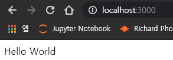

5. Express 라우팅 설정
    - 기본 라우팅 방법: `app.METHOD(PATH, HANDLER)`
        - `METHOD`: HTTP request 메소드
        - `PATH`: 라우트 경로
        - `HANDLER`: 처리할 callback 함수
        ```javascript
        var express = require('express');
        var app = express();
        
        // :id => 라우팅에서 parameter를 설정하는 법
        app.get('/user/:id', function(req, res){
            res.send('Received a GET request, param:' + req.params.id);
        });
        
        // res.json => json 형태의 응답 가능
        app.post('/user', function(req, res) {
            res.json({success: true})
        });
        
        // status code 설정 및 응답 설정
        app.put('/user', function(req, res) {
            res.status(400).json({message: 'Bad Request'});
        });
        
        app.delete('/user', function(req, res){
            res.send('Received a DELETE request');
        });
        ```
    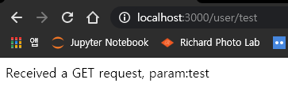

    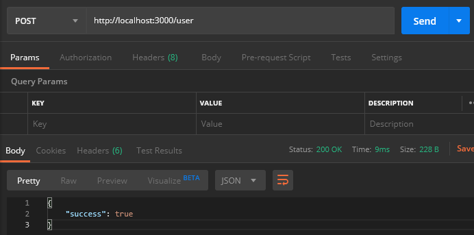

    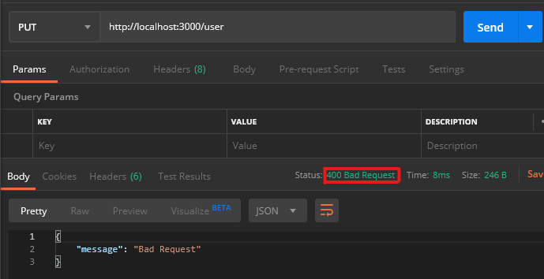

    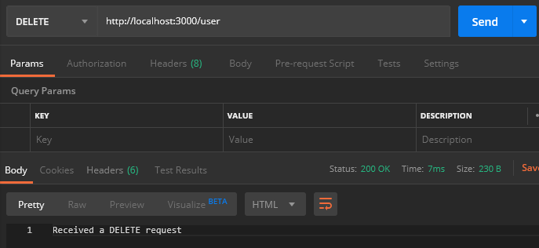

6. 모듈화를 해도 위 스크린샷과 같은 결과가 나오는지 확인
    - 모듈화 장점
        - 한 파일이 너무 커지는 것을 방지
        - 읽기 간결
        - 유지보수 용이
    - routes/user.js 작성
        ```javascript
        // 모듈화를 함
        var express = require('express');
        var router = express.Router();
        
        // :id => 라우팅에서 parameter를 설정하는 법
        router.get('/:id', function(req, res){
            res.send('Received a GET request, param:' + req.params.id);
        });
        
        // res.json => json 형태의 응답 가능
        router.post('/', function(req, res) {
            res.json({success: true})
        });
        
        // status code 설정 및 응답 설정
        router.put('/', function(req, res) {
            res.status(400).json({message: 'Bad Request'});
        });
        
        router.delete('/', function(req, res){
            res.send('Received a DELETE request');
        });
        
        module.exports = router; // router 객체를 내보냄
        ```
    - main.js 수정
     ```javascript
        var express = require('express');
        var app = express();
        var user = require('./routes/user'); // user router를 불러옴
        
        app.use('/user', user); // 만약에 /user로 요청이 들어오면, user router로 연결시킴
        
        // index page에 get 요청이 들어오면, callback function => 'Hello World를 response로 줌'을 실행
        app.get('/', function(req, res){
            res.send('Hello World');
        });
        
        // 서버를 3000 port로 열고, 서버가 열리면 callback function => 'string 출력'을 실행
        app.listen(3000, function() {
            console.log('Example App is listening on port 3000');
        });
        ```

7. Express 미들웨어 설정
    - 미들웨어 함수: 양 쪽을 연결하여 요청/응답을 주고받을 수 있도록 중간에서 매개 역할을 함
        ```
            			 MiddleWare ------------------> 이를 통해서 Express에   
            HTTP request      ↓          Routing        있지 않은 기능을 구현
            ---------------------------------->         할 수 있음
                           Express
            <----------------------------------
                                  HTTP response
        ```
    - `npm install --save morgan body-parser` 실행으로 외부 미들웨어 설치
        - morgan: 로깅 미들웨어
        - body-parser: JSON 형태 데이터 파싱 미들웨어

        설치한 npm module의 github 페이지를 검색하려면, `npm repo morgan` 명령어 사용

    - main.js 수정
        ```javascript
        var express = require('express');
        var app = express();
        var user = require('./routes/user'); // user router를 불러옴
        
        // middleware 사용
        var myLogger = function(req, res, next) {
            console.log(req.url);
            next();
        }
        
        // 외부 logger middleware 사용
        var morgan = require('morgan');
        var 
        
        app.use(myLogger);
        app.use(morgan('dev'));
        
        // middleware 사용 후에 아래 라인이 있어야 myLogger가 정상적으로 작동됨
        app.use('/user', user); // 만약에 /user로 요청이 들어오면, user router로 연결시킴
        
        // index page에 get 요청이 들어오면, callback function => 'Hello World를 response로 줌'을 실행
        app.get('/', function(req, res){
            res.send('Hello World');
        });
        
        // 서버를 3000 port로 열고, 서버가 열리면 callback function => 'string 출력'을 실행
        app.listen(3000, function() {
            console.log('Example App is listening on port 3000');
        });
        ```

    - routes/user.js 수정
        ```javascript
        var express = require('express');
        var router = express.Router();
        
        router.get('/:id', function(req, res){
            res.send('Received a GET request, param:' + req.params.id);
        });
        
        // req.body 출력
        router.post('/', function(req, res) {
            console.log(JSON.stringify(req.body, null, 2));
            res.json({
                success: true,
                user: req.body.username
            });
        });
        
        router.put('/', function(req, res) {
            res.status(400).json({message: 'Bad Request'});
        });
        
        router.delete('/', function(req, res){
            res.send('Received a DELETE request');
        });
        
        module.exports = router;
        ```

        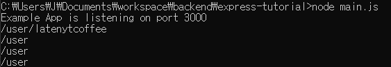

        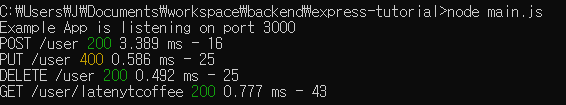

        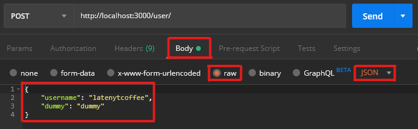

        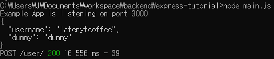

8. static 파일 (html, css, image, etc...) 제공
    - public/index.html 작성
        ```html
        <!DOCTYPE>
        <html>
            <head>
                <title>title</title>
            </head>
            <body>
                <p>HELLO!!!!!!!!!!!!!!!!!!!!!!!!!!!!!!!!!</p>
            </body>
        </html>
        ```
    - public/about.html 작성
        ```html
        <!DOCTYPE>
        <html>
            <head>
                <title>about</title>
            </head>
            <body>
                <p>about</p>
            </body>
        </html>
        ```

    - main.js 수정
        ```javascript
        var express = require('express');
        var app = express();
        var user = require('./routes/user');
        
        var morgan = require('morgan');
        var bodyParser = require('body-parser');
        
        app.use(morgan('dev'));
        app.use(bodyParser.json());
        
        // public 폴더 접근 가능하게끔 설정
        app.use('/', express.static('public'));
        
        app.use('/user', user);
        
        // express.static이 먼저 작성되었으니 아래 line은 우선권이 없음
        app.get('/', function(req, res){
            res.send('Hello World');
        });
        
        app.listen(3000, function() {
            console.log('Example App is listening on port 3000');
        });
        ```

        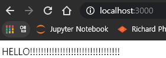

        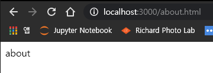
