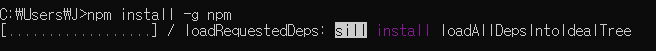
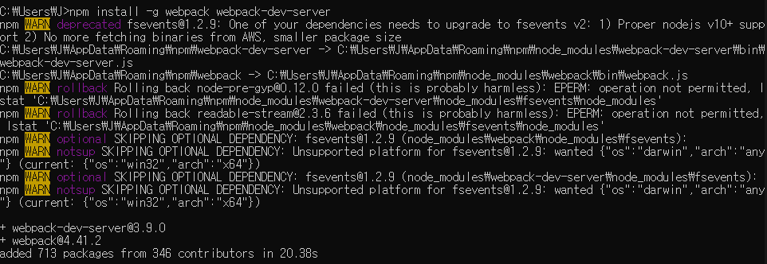
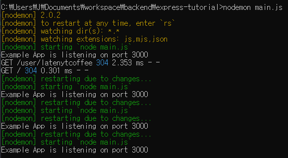
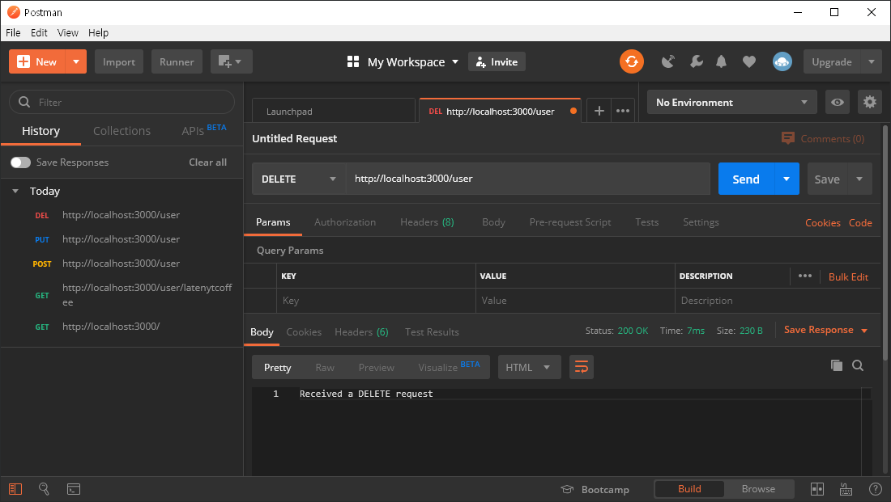

# 1. Node.js 설치

- JavaScript Runtime 환경
- JavaScript를 browser에서만 사용하는 것이 아니라 다른 곳, 예) server-side에서도 사용할 수 있게 해줌

- Node.js 다운로드 링크: [Download | Node.js](https://nodejs.org/en/download/)

- cmd창 혹은 터미널에서 `npm install -g npm` 명령어 사용으로 npm 버전 최신화

    

- `npm install -g webpack webpack-dev-server` 명령어 사용으로 webpack 설치
    - webpack: JavaScript 어플리케이션 static module bundler
        - bundler: 여러 개의 파일 중에 dependency가 있는 파일을 하나의 파일로 묶어 패키징함
        - 파일이 하나로 합쳐지면 네트워킹 요청 횟수가 줄어들기 때문에 performance가 올라감
    - webpack-dev-server: express로 서버를 구축하지 않아도 static file을 다루는 웹서버을 구동 가능, hot-module-replacement라는 기능을 사용하면 수정된 script가 있는 file만 reload

    

- `npm install -g nodemon` 명령어 사용으로 nodemon(*node.js 서버 재시작 helper*) 설치
    - `node main.js` 로 서버를 실행하면, code 수정할 때마다 서버 재시작 필요
    - `nodemon main.js` 로 서버를 실행하면, 알아서 재시작됨

        
        
---

# 2. MongoDB 설치

- MongoDB 다운로드 링크: [Download Center: Community Server](https://www.mongodb.com/download-center/community)

- NoSQL 데이터베이스

- cmd창이나 터미널에서 다음의 명령어 실행
    - mkdir `C:\data\db` ⇒ 기본 데이터베이스 디렉토리 수동으로 생성
    - `C:\Program Files\MongoDB\Server\3.2\bin` 접근 후 `mongod` 명령어 실행

---

# 3. 에디터 : Visual Studio Code 설치

- VS Code 다운로드 링크: [Download Visual Studio Code - Mac, Linux, Windows](https://code.visualstudio.com/download)

## 유용한 VS Code Extension 모음

### Bracket Pair Colorizer2

- `{`, `}` 순차적으로 하이라이트하는 기능 제공

# Change-case

- selection의 case를 바꾸는 기능 제공
    - e.g. `const fooBar = 0;` → `const FOO_BAR = 0;`

### Code Spell Checker

- 기본적인 스펠링 체크를 해주는 기능

### DuplicateSelection

- selection을 복제하는 기능
    - Mac: `cmd` + `d`
    - Win: `ctrl` + `d`

### expand-region

- 단어, `' '`, `[]`, line, function body 등까지 selection을 확장해주는 기능 제공
- expand
    - Win: `ctrl` + `w`
- undo expand
    - Win: `ctrl` + `shift` +  `w`

### File Utils

- file을 쉽게 create/duplicate/move/rename/delete 해주는 기능 제공

### GitLens - Git supercharged

- Git 레포지토리를 쉽게 navigate/explore 해주는 기능 제공

### Multi Line tricks

- Expand Selection to Line (selection을 모든 line까지 확장)
    - Win: `alt` + `l`
- Expand Selection to multi-cursor (selection을 커서 위치까지 확장)
    - Win: `alt` + `shift` + `l`

### Markdown All in One

- Markdown 사용 시 편리한 키보드 shortcut, auto preview 기능 등 제공

### Nest Comments

- 이미 주석이 포함된 line들을 주석처리 가능하게끔 하는 기능 제공
    - Mac: `cmd` + `alt` + `/`
    - Win: `ctrl` + `alt` + `/`

### Path Intellisense

- filename을 자동완성해주는 기능 제공

### Sublime Commands

- 몇몇 Sublime command를 사용할 수 있게끔 하는 기능 제공
    - Transpose (selection을 모든 line까지 확장)
        - Win: `ctrl` + `t`
    - Expand Selection to Line (selection을 모든 line까지 확장)
        - Win: `ctrl` + `l`
    - Split into Line (selection을 모든 line까지 확장)
        - Win: `shift` + `ctrl` + `l`
    - Join Lines (selection을 모든 line까지 확장)
        - Win: `ctrl` + `j`

### Unique Lines

- 중복 라인 제거

### Auto Rename Tag

- `<tag></tag>` 안에 있는 text를 한 번에 바꿔주는 기능 제공

### ESLint

- JavaScript 문법 체크 기능 제공

### htmltagwrap

- selection을 HTML tag로 래핑해주는 기능 제공
    - Mac: `option` + `w`
    - Win: `alt` + `w`

### javascript console utils

- console.log(); 를 자동으로 생성/제거해주는 기능 제공
    - Mac: `cmd` + `shift` + `l`
    - Win: `ctrl` + `shift` + `l`

### npm Intellisense

- npm 모듈을 import할 때 자동적으로 완성시켜주는 기능 제공

### Prettier - Code formatter

- 코드 정리 기능 제공

### Version Lens

- npm, jspm, dub, dotnet 패키지 버전을 보여주는 기능 제공

### ES7 React/Redux/GraphQL/React-Native snippets

- react 사용 시 유용한 snippets을 제공

---

# 4. Postman 설치

- Postman 다운로드 링크: [Download Postman App](https://www.getpostman.com/downloads/)

- 개발한 API를 테스트하고 공유하는 플랫폼

    