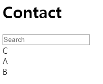
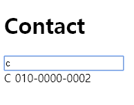
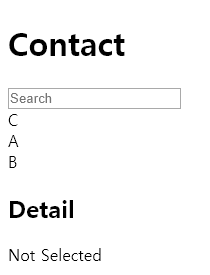
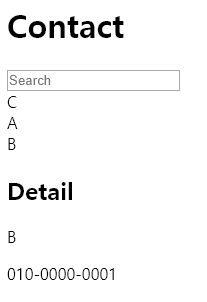

# Sort

- 해당 array를 정렬한다.
    ```javascript
    let fruit = ['strwaberry', 'banana', 'apple', 'graph'];
    fruit.sort(); // 기본적으로 유니코드를 비교, 오름차순 정렬
    /* result: ["apple", "banana", "graph", "strwaberry"] */
    
    function compareNumbers(a, b) { return a - b; }
    let numbers = [1, 100, 0, 99];
    numbers.sort(compareNumbers);
    /* result: [0, 1, 99, 100] */
    ```
# Filter

- 전달된 parameter function이 만족되는 해당 array의 element만 골라서 새로운 array를 생성한다.
    ```javascript
    function isBigEnough(value) { return value >= 10; }
    let filtered = [1, 100, 0, 99].filter(isBigEnough);
    /* filtered: [100, 99] */
    ```
# 주소록 완성하기 - 1

- src/components/App.js 생성
    ```javascript
    import React from 'react';
    import { hot } from 'react-hot-loader/root';
    import Contact from './Contact'
    
    class App extends React.Component {
        render() {
            return ( 
                <Contact/>
            );
        }
    };
    
    export default hot(App);
    ```
- src/components/Contact.js 생성
    ```javascript
    import React from 'react'
    import ContactInfo from './ContactInfo'
    import ContactDetail from './ContactDetail'
    
    export default class Contact extends React.Component {
        constructor(props) {
            super(props);
            this.state = {
                selectedKey: -1,
                keyword: '',
                contactData: [
                    {
                        name: 'C',
                        phone: '010-0000-0002'
                    },
                    {
                        name: 'A',
                        phone: '010-0000-0000'
                    },
                    {
                        name: 'B',
                        phone: '010-0000-0001'
                    }
                ]
            };
    
            this.handleChange = this.handleChange.bind(this);
            this.handleClick = this.handleClick.bind(this);
        }
    
        handleChange(e) {
            this.setState({
                keyword: e.target.value
            });
        }
    
        handleClick(key) {
            this.setState({
                selectedKey: key
            });
            console.log(key);
        }
    
        render() {
            const mapToComponent = (data) => {
                data.sort();
                data = data.filter(
                    (contact) => {
                        return contact.name.toLowerCase().indexOf(this.state.keyword) > -1;
                    });
                return data.map((contact, i) => {
                    return (<ContactInfo 
                        contact={contact} 
                        key={i}
                        onClick={() => this.handleClick(i)}
                        />);
                });
            }
        
            return (
                <div>
                    <h1>Contact</h1>
                    <input 
                        name="keyword" 
                        placeholder="Search" 
                        value={this.state.keyword}
                        onChange={this.handleChange}
                    >
                    </input>
                    {mapToComponent(this.state.contactData)}
                    <ContactDetail 
                        isSelected={this.state.selectedKey != -1}
                        contact={this.state.contactData[this.state.selectedKey]}
                        />
                </div>
            )
        }
    };
    ```
- src/components/ContactInfo.js 생성
    ```javascript
    import React from 'react'
    
    export default class ContactInfo extends React.Component {
        render() {
            return (
                <div onClick={this.props.onClick}>{this.props.contact.name}</div>
            );
        }
    };
    ```
- src/component/ContactDetail.js 생성
    ```javascript
    import React from 'react'
    
    export default class ContactDetail extends React.Component {
        render() {
            const detail = (
                <div>
                    <p>{this.props.contact.name}</p>
                    <p>{this.props.contact.phone}</p>
                </div>
                );
            const blank = (<div>Not Selected</div>);
            return(
                <div>
                    <h2>Detail</h2>
                    {this.props.isSelected ? detail : blank}
                </div>
            );
        }
    }
    
    ContactDetail.defaultProps = {
        contact: {
            name: '',
            phone: ''
        }
    }
    ```
    

    

    

    

## Tips

- Component에는 event가 적용되지 않았음, NativeDOM`(<div>, <input>, <button>, etc...)`에만 적용 가능했었음 ⇒ 지금은 됨    
    ```javascript
    /* Wrong version, but works fine now */
    return data.map((contact, i) => {
    	return (<ContactInfo 
    	    contact={contact} 
    	    key={i}
    	    onClick={() => {console.log(i);}}
    	    />);
    	});

    /* Right version */
    handleClick(key) {
        this.setState({
            selectedKey: key
        });
        console.log(key);
    }
    
    return data.map((contact, i) => {
      return (<ContactInfo 
          contact={contact} 
          key={i}
          onClick={() => this.handleClick(i)}
          />);
    });
    ```