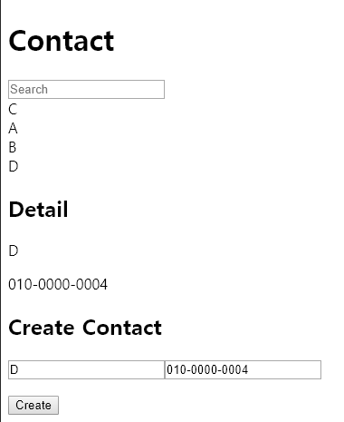
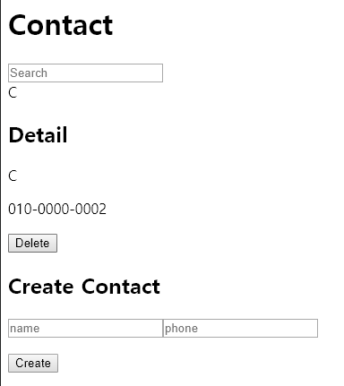
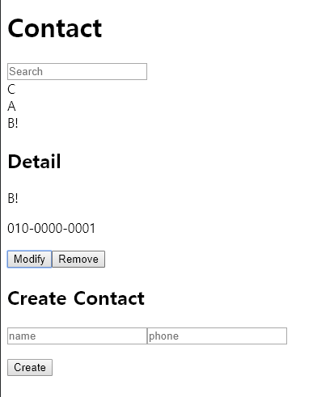

# 주소록 완성하기 - 2

- contact 데이터 추가/수정/제거 기능 만들기
- src/components/Contact.js 수정
    ```javascript
    import React from 'react'
    import update from 'react-addons-update'
    import ContactInfo from './ContactInfo'
    import ContactDetail from './ContactDetail'
    import ContactCreate from './ContactCreate'
    
    export default class Contact extends React.Component {
        constructor(props) {
            super(props);
            this.state = {
                selectedKey: -1,
                keyword: '',
                contactData: [
                    {
                        name: 'C',
                        phone: '010-0000-0002'
                    },
                    {
                        name: 'A',
                        phone: '010-0000-0000'
                    },
                    {
                        name: 'B',
                        phone: '010-0000-0001'
                    }
                ]
            };
    
            this.handleChange = this.handleChange.bind(this);
            this.handleClick = this.handleClick.bind(this);
            this.handleCreate = this.handleCreate.bind(this);
            this.handleRemove = this.handleRemove.bind(this);
            this.handleEdit = this.handleEdit.bind(this);
        }
    
        handleChange(e) {
            this.setState({
                keyword: e.target.value
            });
        }
    
        handleClick(key) {
            this.setState({
                selectedKey: key
            });
            console.log(key);
        }
    
        handleCreate(contact) {
            this.setState({
                contactData: update(
                    this.state.contactData, 
                    {
                        $push: [contact]
                    }
                )
            });
        }
    
        handleRemove() {
            if (this.state.selectedKey < 0) {
                return;
            }
    
            this.setState({
                contactData: update(
                    this.state.contactData, 
                    {
                        $splice: [[this.state.selectedKey, 1]]
                    }
                ),            
                selectedKey: -1
            });
        }
    
        handleEdit(name, phone) {
            this.setState({
                contactData: update(this.state.contactData, {
                    [this.state.selectedKey]: {
                        name: {$set: name},
                        phone: {$set: phone},
                    }
                })
            });
        }
    
        render() {
            const mapToComponent = (data) => {
                data.sort();
                data = data.filter(
                    (contact) => {
                        return contact.name.toLowerCase().indexOf(this.state.keyword) > -1;
                    });
                return data.map((contact, i) => {
                    return (<ContactInfo 
                        contact={contact} 
                        key={i}
                        onClick={() => this.handleClick(i)}
                        />);
                });
            }
        
            return (
                <div>
                    <h1>Contact</h1>
                    <input 
                        name="keyword" 
                        placeholder="Search" 
                        value={this.state.keyword}
                        onChange={this.handleChange}
                    >
                    </input>
                    {mapToComponent(this.state.contactData)}
                    <ContactDetail 
                        isSelected={this.state.selectedKey != -1}
                        contact={this.state.contactData[this.state.selectedKey]}
                        onRemove={this.handleRemove}
                        onEdit={this.handleEdit}
                        />
                    <ContactCreate
                        onCreate={this.handleCreate}
                    />
                </div>
            )
        }
    };
    ```javascript
- src/components/ContactCreate.js 생성
    ```javascript
    import React from 'react'
    import PropTypes from 'prop-types'
    
    export default class ContactCreate extends React.Component {
        constructor(props) {
            super(props);
            this.state = {
                name: '',
                phone: ''
            };
            this.handleChange = this.handleChange.bind(this);
            this.handleClick = this.handleClick.bind(this);
        }
        
        handleChange(e) {
            let nextState = {};
            nextState[e.target.name] = e.target.value;
            this.setState(nextState);
        }
    
        handleClick() {
            const contact = {
                name: this.state.name,
                phone: this.state.phone
            };  
            this.props.onCreate(contact);
            this.setState({
                name: '', 
                phone: ''
            });
        }
    
        render() {
            return (
                <div>
                    <h2>Create Contact</h2>
                    <p>
                        <input
                            type="text"
                            name="name" /* [e.target.name] */
                            placeholder="name"
                            value={this.state.name}
                            onChange={this.handleChange}
                        ></input>
                        <input
                            type="text"
                            name="phone"
                            placeholder="phone"
                            value={this.state.phone}
                            onChange={this.handleChange}
                        ></input>
                    </p>
                    <button onClick={this.handleClick}>Create</button>
                </div>
            );
        }
    };
    
    ContactCreate.propTypes = {
        onCreate: PropTypes.func        
    };
    
    ContactCreate.defaultProps = {
        onCreate: () => { console.error('onCreate not defined'); }     
    };
    ```javascript
- src/component/ContactDetail.js 수정
    ```javascript
    import React from 'react'
    import PropTypes from 'prop-types'
    
    export default class ContactDetail extends React.Component {
        constructor(props) {
            super(props);
    
            this.state = {
                isEdit: false,
                name: '',
                phone: '' 
            };
    
            this.handleToggle = this.handleToggle.bind(this);
            this.handleChange = this.handleChange.bind(this);
            this.handleEdit = this.handleEdit.bind(this);
        }
    
        handleToggle() {
            if (!this.state.isEdit) {
                this.setState({
                    name: this.props.contact.name,
                    phone: this.props.contact.phone
                })
            } else {
                this.handleEdit();
            }
    
            this.setState({ /* setState는 비동기이기 때문에 console.log가 먼저 실행될 수 있음 */
                isEdit: !this.state.isEdit
            });
            /* console.log(this.state.isEdit); */
        }
        
        handleChange(e) {
            let nextState = {};
            nextState[e.target.name] = e.target.value;
            this.setState(nextState);
        }
    
        handleEdit() {
            this.props.onEdit(this.state.name, this.state.phone);
        }
    
        render() {
            const detail = (
                <div>
                    <p>{this.props.contact.name}</p>
                    <p>{this.props.contact.phone}</p>
                </div>
                );
    
            const blank = (<div>Not Selected</div>);
    
            const edit = (
                <div>
                    <p><input
                        type="text"
                        name="name" /* [e.target.name] */
                        placeholder="name"
                        value={this.state.name}
                        onChange={this.handleChange}
                        ></input>
                    </p>
                    <p><input
                        type="text"
                        name="phone"
                        placeholder="phone"
                        value={this.state.phone}
                        onChange={this.handleChange}
                        ></input>
                    </p>
            </div>
            );
    
            const view = this.state.isEdit ? edit : detail;
    
            return(
                <div>
                    <h2>Detail</h2>
                    {this.props.isSelected ? view : blank}
                    <button onClick={this.handleToggle}>
                        {this.state.isEdit ? 'Ok' : 'Modify'}
                    </button>
                    <button onClick={this.props.onRemove}>Remove</button>
                </div>
            );
        }
    }
    
    /* Good practice */
    ContactDetail.propTypes = {
        contact: PropTypes.object,
        onRemove: PropTypes.func,  
        onEdit: PropTypes.func,   
    }
    
    ContactDetail.defaultProps = {
        contact: {
            name: '',
            phone: ''
        },
        onRemove: () => { console.error('onRemove not defined'); },
        onEdit: () => { console.error('onEdit not defined'); }
    }
    ```
    
    *데이터 생성 기능*

    
    *데이터 제거 기능*

    
    *데이터 수정 기능*