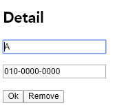
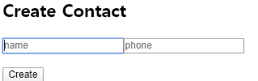
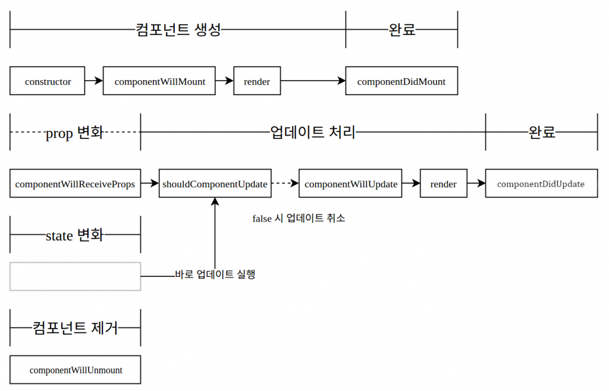
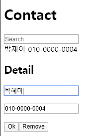

# 주소록 완성하기 - 3

## onKeyPress

### 목표

- Create Contact와 Detail의 input을 수정했을 때 enter만 눌러도 Create/Ok 가 눌린 것처럼 동작하게끔 하자
- src/components/ContactCreate.js 수정
    ```javascript
    import React from 'react'
    import PropTypes from 'prop-types'
    
    export default class ContactCreate extends React.Component {
        constructor(props) {
            super(props);
            this.state = {
                name: '',
                phone: ''
            };
            this.handleChange = this.handleChange.bind(this);
            this.handleClick = this.handleClick.bind(this);
            this.handleKeyPress = this.handleKeyPress.bind(this);  // binding
        }
        
        handleChange(e) {
            let nextState = {};
            nextState[e.target.name] = e.target.value;
            this.setState(nextState);
        }
    
        handleClick() {
            const contact = {
                name: this.state.name,
                phone: this.state.phone
            };  
            this.props.onCreate(contact);
            this.setState({
                name: '', 
                phone: ''
            });
        }
    
        handleKeyPress(e) {
            if (e.charCode === 13) /* 13 == enter */
                this.handleClick();  // onClick 시 실행될 메소드
        }
    
        render() {
            return (
                <div>
                    <h2>Create Contact</h2>
                    <p>
                        <input
                            type="text"
                            name="name" /* [e.target.name] */
                            placeholder="name"
                            value={this.state.name}
                            onChange={this.handleChange}
                        ></input>
                        <input
                            type="text"
                            name="phone"
                            placeholder="phone"
                            value={this.state.phone}
                            onChange={this.handleChange}
                            onKeyPress={this.handleKeyPress}
                        ></input> {/* onKeyPress binding */}
                    </p>
                    <button onClick={this.handleClick}>Create</button>
                </div>
            );
        }
    };
    
    ContactCreate.propTypes = {
        onCreate: PropTypes.func        
    };
    
    ContactCreate.defaultProps = {
        onCreate: () => { console.error('onCreate not defined'); }     
    };
    ```
- src/components/ContactDetail.js 수정
    ```javascript
    import React from 'react'
    import PropTypes from 'prop-types'
    
    export default class ContactDetail extends React.Component {
        constructor(props) {
            super(props);
    
            this.state = {
                isEdit: false,
                name: '',
                phone: '' 
            };
    
            this.handleToggle = this.handleToggle.bind(this);
            this.handleChange = this.handleChange.bind(this);
            this.handleEdit = this.handleEdit.bind(this);
            this.handleKeyPress = this.handleKeyPress.bind(this); // binding
        }
    
        handleToggle() {
            if (!this.state.isEdit) {
                this.setState({
                    name: this.props.contact.name,
                    phone: this.props.contact.phone
                })
            } else {
                this.handleEdit();
            }
    
            this.setState({
                isEdit: !this.state.isEdit
            });
        }
        
        handleChange(e) {
            let nextState = {};
            nextState[e.target.name] = e.target.value;
            this.setState(nextState);
        }
    
        handleEdit() {
            this.props.onEdit(this.state.name, this.state.phone);
        }
    
        handleKeyPress(e) {
            if (e.charCode === 13) // event는 '13 == enter'
                this.handleToggle(); // onClick 시 실행될 메소드
        }
    
        render() {
            const detail = (
                <div>
                    <p>{this.props.contact.name}</p>
                    <p>{this.props.contact.phone}</p>
                </div>
                );
    
            const blank = (<div>Not Selected</div>);
            const edit = (
                <div>
                    <p><input
                        type="text"
                        name="name" /* [e.target.name] */
                        placeholder="name"
                        value={this.state.name}
                        onChange={this.handleChange}
                        ></input>
                    </p>
                    <p><input
                        type="text"
                        name="phone"
                        placeholder="phone"
                        value={this.state.phone}
                        onChange={this.handleChange}
                        onKeyPress={this.handleKeyPress}
                        ></input> {/* onKeyPress binding */}
                    </p>
            </div>
            );
            const view = this.state.isEdit ? edit : detail;
    
            return(
                <div>
                    <h2>Detail</h2>
                    {this.props.isSelected ? view : blank}
                    <button onClick={this.handleToggle}>
                        {this.state.isEdit ? 'Ok' : 'Modify'}
                    </button>
                    <button onClick={this.props.onRemove}>Remove</button>
                </div>
            );
        }
    }
    
    ContactDetail.propTypes = {
        contact: PropTypes.object,
        onRemove: PropTypes.func,  
        onEdit: PropTypes.func,   
    }
    
    ContactDetail.defaultProps = {
        contact: {
            name: '',
            phone: ''
        },
        onRemove: () => { console.error('onRemove not defined'); },
        onEdit: () => { console.error('onEdit not defined'); }
    }    
    ```
## ref

- `document.getElementById(id).focus();` 는 사용하지 않는 것이 좋음, 여러개의 component에 중첩된 id가 존재할 수 있기 때문.
- element나 component의 id 역할을 함

    rendering method 내부와 constructor method 내부에서는 ref에 접근할 수 없음
    ```javascript
    class Hello extends React.Component {
        render() {
            return (
                <div>
                    <input ref={(ref) => {this.input = ref}}></input>
                </div>
            );	
        }
        
        componentDidMount() { /* componentDidMount => Component LifeCycle Api 중 하나 */
            this.input.value = "I used ref to do this";
        }
    }
    
    ReactDOM.render(
        <Hello/>
        document.getElementById('app')
    );
    
    // or since React version 16.4
    class Hello extends React.Componet {
        constructor(props) {
            super(props);
            this.nameInput = React.createRef();
        }
    
        render() {
            return (
                <div>
                    <input ref={this.nameInput}></input>
                </div>
            );
        }
        
        componentDidMount() {
            this.nameInput.current.value = "I used ref to do this";
        }
    }
    
    ReactDOM.render(
        <Hello/>
        document.getElementById('app')
    );
    ```
### 목표

- Detail에서 Modify를 누르면 name에 cursor를 focus 시키자.
    - src/components/ContactDetail.js 수정
    ```javascript
    import React from 'react'
    import PropTypes from 'prop-types'
    
    export default class ContactDetail extends React.Component {
        constructor(props) {
            super(props);
    
            this.state = {
                isEdit: false,
                name: '',
                phone: '' 
            };
    
            this.handleToggle = this.handleToggle.bind(this);
            this.handleChange = this.handleChange.bind(this);
            this.handleEdit = this.handleEdit.bind(this);
            this.handleKeyPress = this.handleKeyPress.bind(this);
    
            /* define ref in constructor is available since React version 16.4 */
            this.nameInput = React.createRef();
        }
    
        handleToggle() {
            if (!this.props.isSelected)
                return;
    
            if (!this.state.isEdit) {
                this.setState({
                    name: this.props.contact.name,
                    phone: this.props.contact.phone
                })
            } else {
                this.handleEdit();
            }
    
            this.setState({
                isEdit: !this.state.isEdit
            });
        }
        
        handleChange(e) {
            let nextState = {};
            nextState[e.target.name] = e.target.value;
            this.setState(nextState);
        }
    
        handleEdit() {
            this.props.onEdit(this.state.name, this.state.phone);
        }
    
        handleKeyPress(e) {
            if (e.charCode === 13)
                this.handleToggle();
        }
    
        render() {
            const detail = (
                <div>
                    <p>{this.props.contact.name}</p>
                    <p>{this.props.contact.phone}</p>
                </div>
                );
    
            const blank = (<div>Not Selected</div>);
            const edit = (
                <div>
                    <p><input
                        type="text"
                        name="name" 
                        placeholder="name"
                        value={this.state.name}
                        onChange={this.handleChange}
                        ref={this.nameInput}
                        /*ref={(ref) => {this.nameInput}}*/
                        ></input>
                    </p>
                    <p><input
                        type="text"
                        name="phone"
                        placeholder="phone"
                        value={this.state.phone}
                        onChange={this.handleChange}
                        onKeyPress={this.handleKeyPress}
                        ></input>
                    </p>
            </div>
            );
            const view = this.state.isEdit ? edit : detail;
    
            return(
                <div>
                    <h2>Detail</h2>
                    {this.props.isSelected ? view : blank}
                    <button onClick={this.handleToggle}>
                        {this.state.isEdit ? 'Ok' : 'Modify'}
                    </button>
                    <button onClick={this.props.onRemove}>Remove</button>
                </div>
            );
        }
    
        componentDidUpdate() { /* componentDidUpdate => Component LifeCycle Api 중 하나 */
            if (this.nameInput.current !== null)
                this.nameInput.current.focus();
        }
    }
    
    ContactDetail.propTypes = {
        contact: PropTypes.object,
        onRemove: PropTypes.func,  
        onEdit: PropTypes.func,   
    }
    
    ContactDetail.defaultProps = {
        contact: {
            name: '',
            phone: ''
        },
        onRemove: () => { console.error('onRemove not defined'); },
        onEdit: () => { console.error('onEdit not defined'); }
    }
    ```

    
    
- Create Contact에서 Create하고 나서 name input에 cursor를 focus 시키자
    - src/components/ContactCreate.js 수정
    ```javascript
    import React from 'react'
    import PropTypes from 'prop-types'
    
    export default class ContactCreate extends React.Component {
        constructor(props) {
            super(props);
            
            this.state = {
                name: '',
                phone: ''
            };
    
            this.handleChange = this.handleChange.bind(this);
            this.handleClick = this.handleClick.bind(this);
            this.handleKeyPress = this.handleKeyPress.bind(this);
        }
        
        handleChange(e) {
            let nextState = {};
            nextState[e.target.name] = e.target.value;
            this.setState(nextState);
        }
    
        handleClick() {
            const contact = {
                name: this.state.name,
                phone: this.state.phone
            };  
            
            this.props.onCreate(contact);
            this.setState({
                name: '', 
                phone: ''
            });
    
            this.nameInput.focus();
        }
    
        handleKeyPress(e) {
            if (e.charCode === 13)
                this.handleClick();
        }
    
        render() {
            return (
                <div>
                    <h2>Create Contact</h2>
                    <p><input
                            type="text"
                            name="name"
                            placeholder="name"
                            value={this.state.name}
                            onChange={this.handleChange}
                            ref={(ref) => {this.nameInput = ref}} /* nameInput에 ref를 걸음 */
                        ></input>
                        <input
                            type="text"
                            name="phone"
                            placeholder="phone"
                            value={this.state.phone}
                            onChange={this.handleChange}
                            onKeyPress={this.handleKeyPress}
                        ></input> 
                    </p>
                    <button onClick={this.handleClick}>Create</button>
                </div>
            );
        }
    };
    
    ContactCreate.propTypes = {
        onCreate: PropTypes.func        
    };
    
    ContactCreate.defaultProps = {
        onCreate: () => { console.error('onCreate not defined'); }     
    };
    ```
    

## Local Storage - HTML5

- cookie는 domain당 4KB, localStorage는 2.5MB ~ 5MB까지 저장할 수 있음

### 목표

- Local Storage를 이용하여, 새로고침을 해도 브라우저에 이전 contact 기록을 유지하게끔 하자
    - src/component/Contact.js 수정
    ```javascript
    import React from 'react'
    import update from 'react-addons-update'
    import ContactInfo from './ContactInfo'
    import ContactDetail from './ContactDetail'
    import ContactCreate from './ContactCreate'
    
    export default class Contact extends React.Component {
        constructor(props) {
            super(props);
            this.state = {
                selectedKey: -1,
                keyword: '',
                contactData: [
                    {
                        name: 'C',
                        phone: '010-0000-0002'
                    },
                    {
                        name: 'A',
                        phone: '010-0000-0000'
                    },
                    {
                        name: 'B',
                        phone: '010-0000-0001'
                    }
                ]
            };
    
            this.handleChange = this.handleChange.bind(this);
            this.handleClick = this.handleClick.bind(this);
            this.handleCreate = this.handleCreate.bind(this);
            this.handleRemove = this.handleRemove.bind(this);
            this.handleEdit = this.handleEdit.bind(this);
        }
    
            /* localStorage 사용하기 */
        componentWillMount() {
            const contactData = localStorage.contactData;
            
            if (contactData)
            {            
                this.setState({
                contactData: JSON.parse(contactData)
                })
            }
        }
    
        componentDidUpdate(prevProps, prevState) {
            if (JSON.stringify(prevState.contactData) != JSON.stringify(this.state.contactData)) {
                localStorage.contactData = JSON.stringify(this.state.contactData);
            }
        }
    
        handleChange(e) {
            this.setState({
                keyword: e.target.value
            });
        }
    
        handleClick(key) {
            this.setState({
                selectedKey: key
            });
        }
    
        handleCreate(contact) {
            this.setState({
                contactData: update(
                    this.state.contactData, 
                    {
                        $push: [contact]
                    }
                )
            });
        }
    
        handleRemove() {
            if (this.state.selectedKey < 0) {
                return;
            }
    
            this.setState({
                contactData: update(
                    this.state.contactData, 
                    {
                        $splice: [[this.state.selectedKey, 1]]
                    }
                ),            
                selectedKey: -1
            });
        }
    
        handleEdit(name, phone) {
            this.setState({
                contactData: update(this.state.contactData, {
                    [this.state.selectedKey]: {
                        name: {$set: name},
                        phone: {$set: phone},
                    }
                })
            });
        }
    
        render() {
            const mapToComponent = (data) => {
                data.sort();
                data = data.filter(
                    (contact) => {
                        return contact.name.toLowerCase().indexOf(this.state.keyword) > -1;
                    });
                return data.map((contact, i) => {
                    return (<ContactInfo 
                        contact={contact} 
                        key={i}
                        onClick={() => this.handleClick(i)}
                        />);
                });
            }
        
            return (
                <div>
                    <h1>Contact</h1>
                    <input 
                        name="keyword" 
                        placeholder="Search" 
                        value={this.state.keyword}
                        onChange={this.handleChange}
                    >
                    </input>
                    {mapToComponent(this.state.contactData)}
                    <ContactDetail 
                        isSelected={this.state.selectedKey != -1}
                        contact={this.state.contactData[this.state.selectedKey]}
                        onRemove={this.handleRemove}
                        onEdit={this.handleEdit}
                        />
                    <ContactCreate
                        onCreate={this.handleCreate}
                    />
                </div>
            )
        }
    };
    ```
# Component LifeCycle API


*[https://velopert.com/1130](https://velopert.com/1130)*

1. constructor: component가 처음 만들어질 때 실행
    ```javascript
    constructor(props) {
        super(props);
        /* 기본 state 설정 가능 */
    }
    ```
2. componentWillMount: 렌더링되기 전에 실행
    ```javascript
    componentWillMount() {
        /* component가 DOM 위에 만들어지기 전에 실행되므로 DOM 처리를 할 수 없음 */
    }
    ```
3. componentDidMount: component가 만들어지고 첫 렌더링된 다음에 실행
    ```javascript
    componentDidMount() {
        /* 다른 자바스크립트 프레임워크 연동 및 setTimeOut, setInterval 및 AJAX 사용 */
        /* 당연히 DOM 처리 가능 */
    }
    ```
4. componentWillReceiveProps: 새로운 props를 받았을 때 실행
    ```javascript
    componentWillReceiveProps(nextProps) {
        console.log('componentWillReceiveProps:' + JSON.stringify(nextProps));
        /* props에 따라 state를 업데이트 할 때 사용하면 유용 */
        /* setState를 사용해도 괜찮음 */ 
    }
    ```
5. shouldComponentUpdate: props/state가 변경되었을 때 component가 update를 해야할지 말아야할지 정함
    ```javascript
    shouldComponenetUpdate(nextProps, nextState) {
        console.log('shouldComponentUpdate:' + JSON.stringify(nextProps) + '' + JSON.stringify(nextState));
        /* 사용 시 필요한 비교를 하고 값을 반환해야 해야 함 */
        if (true) /* 예: return nextProps.id !== this.props.id */
            return true;
    }
    ```
6. componentWillUpdate: component가 update되기 전에 실행
    ```javascript
    componentWillUpdate(nextProps, nextState) {
        console.log('componentWillUpdate:' + JSON.stringify(nextProps) + '' + JSON.stringify(nextState));
        /* setState를 사용하면 무한 루프에 빠질 수 있음 */
    }
    ```

7. componentDidUpdate: component가 update된 다음에 실행
    ```javascript
    componentDidUpdate(prevProps, prevState) {
        console.log('componentDidUpdate');
        /* setState를 사용하면 무한 루프에 빠질 수 있음 */
    }
    ```

8. componentWillUnmount: component가 DOM에서 제거된 다음에 실행    
    ```javascript
    componetWillUnmount() {
        console.log('componetWillUnmount');
    }
    ```

    ---

    Todo : Bug Fix

    