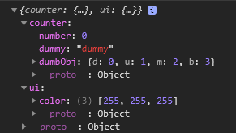
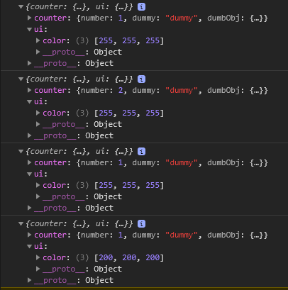
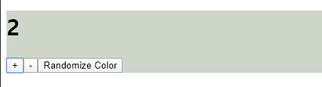

# Redux을 이용하여 Counter 완성하기

- src/components/App.js 생성
    ```javascript
    import React, { Component } from 'react'
    
    import Counter from './Counter'
    
    export default class App extends Component {
        render() {
            return (
                <Counter/>
            )
        }
    }
    ```
- src/components/Counter.js 생성
    ```javascript
        import React, { Component } from 'react'
        
        import Value from './Value'
        import Control from './Control'
        import * as actions from '../actions'
        
        import { connect } from 'react-redux' 
        /* import { connect, bindActionCreators } from 'react-redux' */
        
        /* number, color state를 각각 props에 연결 */
        const mapStateToProps = (state) => {
            return {
                number: state.counter.number,
                color: state.ui.color
            };
        };
        
        const mapDispatchToProps = (dispatch) => {
            // return bindActionCreators(actions, dispatch); /* 임의로 이름 설정이 불가한 것이 단점 */
            return {
                handleIncrement: () => { dispatch(actions.increment()) },
                handleDecrement: () => { dispatch(actions.decrement()) },
                handleSetColor: (color) => { dispatch(actions.setColor(color)) }
            };
    };
    
    class Counter extends Component {
        constructor(props) {
            super(props);
    
            this.setRandomColor = this.setRandomColor.bind(this);
        }
    
        setRandomColor() {
            const color = [
                Math.floor((Math.random() * 55) + 200),
                Math.floor((Math.random() * 55) + 200),
                Math.floor((Math.random() * 55) + 200),
            ];
    
            this.props.handleSetColor(color);
        }
    
        render() {
            const color = this.props.color;
            const style = {
                /* background: `rgb(${color[0]}, ${color[1]}, ${color[2]})` */
                            background: `rgb(${color.join(',')})`
            };
    
            return (
                <div style={style}>
                    <Value number={this.props.number} />
                    <Control 
                        onPlus={this.props.handleIncrement}
                        onSubtract={this.props.handleDecrement}
                        onRandomizeColor={this.setRandomColor}
                        />
                </div>
            );
        }
    }
    
        /* <Value number={this.props.store.getState().counter.number} /> 이렇게 사용하지 않기 위해서 map펑션 사용 */
    export default connect(mapStateToProps, mapDispatchToProps)(Counter);
    ```
- src/components/Value.js 생성
    ```javascript
    import React, { Component } from 'react'
    import PropTypes from 'prop-types'
    
    const propTypes = {
        number: PropTypes.number
    };
    
    const defaultProps = {
        number: -1
    }; 
    
    export default class Value extends Component {
        constructor(props) {
            super(props);
            this.state = {
                number: -1
            };
        }
        render() {
            return (
                <div>
                    <h1>{this.props.number}</h1>
                </div>
            )
        }
    }
    
    Value.propTypes = propTypes;
    Value.defaultProps = defaultProps;
    ```
- src/components/Control.js 생성
    ```javascript
    import React, { Component } from 'react'
    import PropTypes from 'prop-types'
    
    const propTypes = {
        onPlus: PropTypes.func,
        onSubtract: PropTypes.func,
        onRandomizeColor: PropTypes.func
    };
    
    function createWarning(funcName) {
        return () => console.warn(funcName + ' is not defined')
    }
    
    const defaultProps = {
        onPlus: createWarning('onPlus'),
        onSubtract: createWarning('onSubtract'),
        onRandomizeColor: createWarning('onRandomizeColor'),
    };
    
    export default class Control extends Component {
        render() {
            return (
                <div>
                    <button onClick={this.props.onPlus}>+</button>
                    <button onClick={this.props.onSubtract}>-</button>
                    <button onClick={this.props.onRandomizeColor}>Randomize Color</button>
                </div>
            )
        }
    }
    
    Control.propTypes = propTypes;
    Control.defaultProps = defaultProps;
    ```

- src/actions/ActionTypes.js 생성
    ```javascript
    export const INCREMENT = "INCREMENT";
    export const DECREMENT = "DECREMENT";
    export const SET_COLOR = "SET_COLOR";
    ```

- src/actions/index.js 생성
    ```javascript
    import * as types from "./ActionTypes";
    
    /* action 객체를 만들기 귀찮으니 action 생성자 함수를 만들자 */
    export function increment() {
        return {
            type: types.INCREMENT
        };
    }
    
    export function decrement() {
        return {
            type: types.DECREMENT
        };
    }
    
    export function setColor(color) {
        return {
            type: types.SET_COLOR,
            color: color
        };
    }
    ```

- src/reducers/Counter.js 생성
    ```javascript
    import * as types from '../actions/ActionTypes'
    
    /* 초기 상태 작성 */
    const initialState = {
        number: 0,
        dummy: 'dummy',
        dumbObj: {
            d: 0,
            u: 1,
            m: 2,
            b: 3
        }
    };
    
    export default function counter(state = initialState, action) {    
        /*if (typeof state === 'undefined') {
            return initialState;
        }*/
        
        switch(action.type) {
            case types.INCREMENT:
                return { 
                    ...state, 
                    number: state.number + 1,
                    dumbObj: { ...state.dumbObj, u: 100 }
                };
            case types.DECREMENT:
                return { 
                    ...state, 
                    number: state.number - 1 
                };
            default:
                return state;
        }
    }
    ```

- src/reducers/UI.js 생성
    ```javascript
    import * as types from '../actions/ActionTypes'
    
    /* 배경화면 색 바꾸기 */
    const initialState = {
        color: [255, 255, 255]
    };
    
    export default function ui(state = initialState, action)
    {
        if (action.type === types.SET_COLOR) {
            return {
                color: action.color
            };
        } else {
            return state;
        }
    }
    ```

- src/reducers/index.js 생성
    ```javascript
    import { combineReducers } from 'redux'
    import counter from './Counter'
    import ui from './UI'
    
    const reducers = combineReducers({
        counter, ui
    });
    
    export default reducers;
    ```

- src/index.js 생성
    - store 역할
        1. `dispatch(action)`
        2. `getState()`
        3. `subscribe(listener)` => listener가 상태가 바뀔때마다 실행될 callback 함수
        4. `replaceReducer(nextReducer)`
    - store 테스트
        ```javascript
        import React from 'react'
        import ReactDOM from 'react-dom'
        import App from './components/App'
        
        import { createStore } from 'redux'
        import reducers from './reducers'
        
        const store = createStore(reducers);
        
        console.log(store.getState()); /* 현재 상태 출력 */
        
        ReactDOM.render(
            <App/>,
            document.getElementById('root')
        );
        ```
        
        
        ```javascript
        import React from 'react'
        import ReactDOM from 'react-dom'
        import App from './components/App'
        
        import { createStore } from 'redux'
        import reducers from './reducers'
        import * as actions from './actions'
        
        const store = createStore(reducers);
        
        const unsubscribe = store.subscribe(() => console.log(store.getState())); /* store에 변화가 있을 때 현재 상태 출력*/
        store.dispatch(actions.increment());
        store.dispatch(actions.increment());
        store.dispatch(actions.decrement());
        store.dispatch(actions.setColor([200, 200, 200]));
        
        unsubscribe(); /* 이후 dispatch되는 것들은 무시됨 */
        store.dispatch(actions.setColor([210, 210, 210]));
        
        ReactDOM.render(
            <App/>,
            document.getElementById('root')
        );
        ```
        
        
    - react-redux 핵심
        1. Provider: component에서 redux를 사용할 수 있게 함
        2. Connect([...options]): component를 Redux에 연결하는 *또 다른 함수*를 반환함
            - e.g. `connect()(counter)` ⇒ store에 연결된 새로운 component class가 반환됨
            - 옵션 없으면, `this.props.store`로 접근 가능
            - 옵션 4가지 `connect([mapStateToProps], [mapDispatchToProps], [mergeProps], [options])`
                1. mapStateToProps: state를 parameter로 가진 함수, state를 해당 component의 props로 연결해줌
                2. mapDispatchToProps: dispatch를 parameter로 가진 함수, dispatch한 함수를 해당 component의 props로 연결해줌
                3. mergeProps: state와 dispatch를 parameter로 가진 함수, 만약에 component에 연결해야하는 props가 state와 dispatch를 둘 다 사용해야하는 경우 사용됨
                4. options: 객체 형태, `{[pure = true], [withRef = false]}`
                    - pure = true인 경우, 불필요한 업데이트를 하지 않음
                    - withRef = true인 경우, Redux에 연결된 component를 ref에 담아서 `getWrappedInstance()` 통해서 접근할 수 있게 함
        ```javascript
        /* react-redux : view layer binding 사용하기 */
        import React from 'react'
        import ReactDOM from 'react-dom'
        import App from './components/App'
        
        import { createStore } from 'redux'
        import { Provider } from 'react-redux'
        
        import reducers from './reducers'
        
        const store = createStore(reducers);
        
        ReactDOM.render(
            <Provider store={store}>
                <App/>
            </Provider>,
            document.getElementById('root')
        );
        ```
        