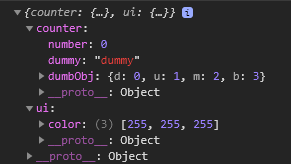

title: Day 9

startTime: Dec 21, 2019 10:07 PM

# Redux을 이용하여 Counter 완성하기

- src/components/App.js 생성

        import React, { Component } from 'react'
        
        import Counter from './Counter'
        
        export default class App extends Component {
            render() {
                return (
                    <Counter/>
                )
            }
        }

- src/components/Counter.js 생성

        import React, { Component } from 'react'
        
        import Value from './Value'
        import Control from './Control'
        import * as actions from '../actions'
        
        import { connect } from 'react-redux' 
        /* import { connect, bindActionCreators } from 'react-redux' */
        
        /* number, color state를 각각 props에 연결 */
        const mapStateToProps = (state) => {
            return {
                number: state.counter.number,
                color: state.ui.color
            };
        };
        
        const mapDispatchToProps = (dispatch) => {
            // return bindActionCreators(actions, dispatch); /* 임의로 이름 설정이 불가한 것이 단점 */
            return {
                handleIncrement: () => { dispatch(actions.increment()) },
                handleDecrement: () => { dispatch(actions.decrement()) },
                handleSetColor: (color) => { dispatch(actions.setColor(color)) }
            };
        };
        
        class Counter extends Component {
            constructor(props) {
                super(props);
        
                this.setRandomColor = this.setRandomColor.bind(this);
            }
        
            setRandomColor() {
                const color = [
                    Math.floor((Math.random() * 55) + 200),
                    Math.floor((Math.random() * 55) + 200),
                    Math.floor((Math.random() * 55) + 200),
                ];
        
                this.props.handleSetColor(color);
            }
        
            render() {
                const color = this.props.color;
                const style = {
                    /* background: `rgb(${color[0]}, ${color[1]}, ${color[2]})` */
        						background: `rgb(${color.join(',')})`
                };
        
                return (
                    

                        <Value number={this.props.number} />
                        <Control 
                            onPlus={this.props.handleIncrement}
                            onSubtract={this.props.handleDecrement}
                            onRandomizeColor={this.setRandomColor}
                            />
                    

                );
            }
        }
        
         /* <Value number={this.props.store.getState().counter.number} /> 이렇게 사용하지 않기 위해서 map펑션 사용 */
        export default connect(mapStateToProps, mapDispatchToProps)(Counter);

- src/components/Value.js 생성

        import React, { Component } from 'react'
        import PropTypes from 'prop-types'
        
        const propTypes = {
            number: PropTypes.number
        };
        
        const defaultProps = {
            number: -1
        }; 
        
        export default class Value extends Component {
            constructor(props) {
                super(props);
                this.state = {
                    number: -1
                };
            }
            render() {
                return (
                    

                        <h1>{this.props.number}</h1>
                    

                )
            }
        }
        
        Value.propTypes = propTypes;
        Value.defaultProps = defaultProps;

- src/components/Control.js 생성

        import React, { Component } from 'react'
        import PropTypes from 'prop-types'
        
        const propTypes = {
            onPlus: PropTypes.func,
            onSubtract: PropTypes.func,
            onRandomizeColor: PropTypes.func
        };
        
        function createWarning(funcName) {
            return () => console.warn(funcName + ' is not defined')
        }
        
        const defaultProps = {
            onPlus: createWarning('onPlus'),
            onSubtract: createWarning('onSubtract'),
            onRandomizeColor: createWarning('onRandomizeColor'),
        };
        
        export default class Control extends Component {
            render() {
                return (
                    

                        <button onClick={this.props.onPlus}>+</button>
                        <button onClick={this.props.onSubtract}>-</button>
                        <button onClick={this.props.onRandomizeColor}>Randomize Color</button>
                    

                )
            }
        }
        
        Control.propTypes = propTypes;
        Control.defaultProps = defaultProps;

- src/actions/ActionTypes.js 생성

        export const INCREMENT = "INCREMENT";
        export const DECREMENT = "DECREMENT";
        export const SET_COLOR = "SET_COLOR";

- src/actions/index.js 생성

        import * as types from "./ActionTypes";
        
        /* action 객체를 만들기 귀찮으니 action 생성자 함수를 만들자 */
        export function increment() {
            return {
                type: types.INCREMENT
            };
        }
        
        export function decrement() {
            return {
                type: types.DECREMENT
            };
        }
        
        export function setColor(color) {
            return {
                type: types.SET_COLOR,
                color: color
            };
        }

- src/reducers/Counter.js 생성

        import * as types from '../actions/ActionTypes'
        
        /* 초기 상태 작성 */
        const initialState = {
            number: 0,
            dummy: 'dummy',
            dumbObj: {
                d: 0,
                u: 1,
                m: 2,
                b: 3
            }
        };
        
        export default function counter(state = initialState, action) {    
            /*if (typeof state === 'undefined') {
                return initialState;
            }*/
            
            switch(action.type) {
                case types.INCREMENT:
                    return { 
                        ...state, 
                        number: state.number + 1,
                        dumbObj: { ...state.dumbObj, u: 100 }
                    };
                case types.DECREMENT:
                    return { 
                        ...state, 
                        number: state.number - 1 
                    };
                default:
                    return state;
            }
        }

- src/reducers/UI.js 생성

        import * as types from '../actions/ActionTypes'
        
        /* 배경화면 색 바꾸기 */
        const initialState = {
            color: [255, 255, 255]
        };
        
        export default function ui(state = initialState, action)
        {
            if (action.type === types.SET_COLOR) {
                return {
                    color: action.color
                };
            } else {
                return state;
            }
        }

- src/reducers/index.js 생성

        import { combineReducers } from 'redux'
        import counter from './Counter'
        import ui from './UI'
        
        const reducers = combineReducers({
            counter, ui
        });
        
        export default reducers;

- src/index.js 생성
    - store 역할
        1. `dispatch(action)`
        2. `getState()`
        3. `subscribe(listener)` => listener가 상태가 바뀔때마다 실행될 callback 함수
        4. `replaceReducer(nextReducer)`
    - store 테스트

            import React from 'react'
            import ReactDOM from 'react-dom'
            import App from './components/App'
            
            import { createStore } from 'redux'
            import reducers from './reducers'
            
            const store = createStore(reducers);
            
            console.log(store.getState()); /* 현재 상태 출력 */
            
            ReactDOM.render(
                <App/>,
                document.getElementById('root')
            );

        

        초기 상태 출력

            import React from 'react'
            import ReactDOM from 'react-dom'
            import App from './components/App'
            
            import { createStore } from 'redux'
            import reducers from './reducers'
            import * as actions from './actions'
            
            const store = createStore(reducers);
            
            const unsubscribe = store.subscribe(() => console.log(store.getState())); /* store에 변화가 있을 때 현재 상태 출력*/
            store.dispatch(actions.increment());
            store.dispatch(actions.increment());
            store.dispatch(actions.decrement());
            store.dispatch(actions.setColor([200, 200, 200]));
            
            unsubscribe(); /* 이후 dispatch되는 것들은 무시됨 */
            store.dispatch(actions.setColor([210, 210, 210]));
            
            ReactDOM.render(
                <App/>,
                document.getElementById('root')
            );

        

        dispatch한 결과

    - react-redux 핵심
        1. Provider: component에서 redux를 사용할 수 있게 함
        2. Connect([...options]): component를 Redux에 연결하는 *또 다른 함수*를 반환함
            - e.g. `connect()(counter)` ⇒ store에 연결된 새로운 component class가 반환됨
            - 옵션 없으면, `this.props.store`로 접근 가능
            - 옵션 4가지 `connect([mapStateToProps], [mapDispatchToProps], [mergeProps], [options])`
                1. mapStateToProps: state를 parameter로 가진 함수, state를 해당 component의 props로 연결해줌
                2. mapDispatchToProps: dispatch를 parameter로 가진 함수, dispatch한 함수를 해당 component의 props로 연결해줌
                3. mergeProps: state와 dispatch를 parameter로 가진 함수, 만약에 component에 연결해야하는 props가 state와 dispatch를 둘 다 사용해야하는 경우 사용됨
                4. options: 객체 형태, `{[pure = true], [withRef = false]}`
                    - pure = true인 경우, 불필요한 업데이트를 하지 않음
                    - withRef = true인 경우, Redux에 연결된 component를 ref에 담아서 `getWrappedInstance()` 통해서 접근할 수 있게 함

        /* react-redux : view layer binding 사용하기 */
        import React from 'react'
        import ReactDOM from 'react-dom'
        import App from './components/App'
        
        import { createStore } from 'redux'
        import { Provider } from 'react-redux'
        
        import reducers from './reducers'
        
        const store = createStore(reducers);
        
        ReactDOM.render(
            <Provider store={store}>
                <App/>
            </Provider>,
            document.getElementById('root')
        );

